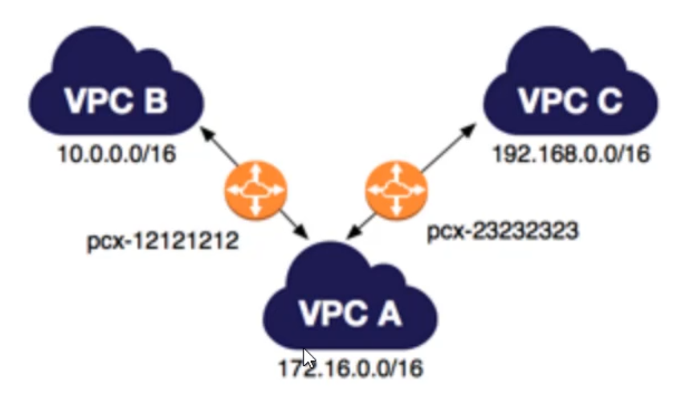
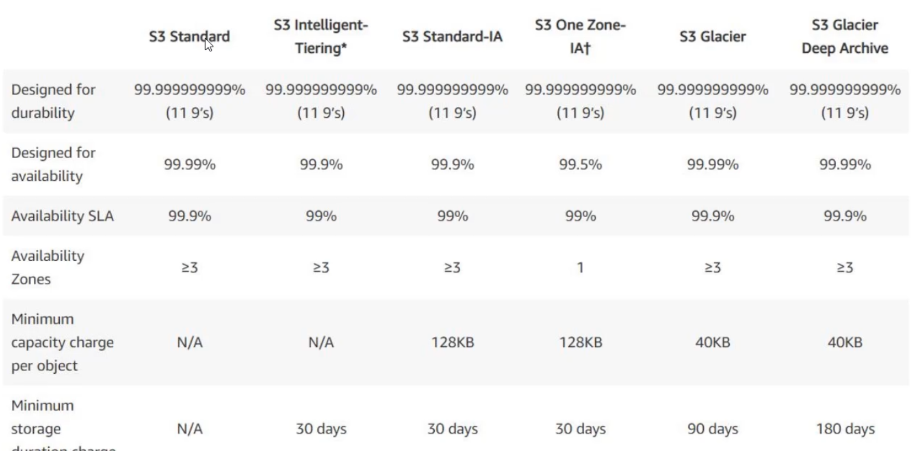

- [1. take away](#1-take-away)
- [2. chat](#2-chat)
- [3. lab setup](#3-lab-setup)
  - [3.1. accessing](#31-accessing)
  - [3.2. setting up](#32-setting-up)
- [4. intro](#4-intro)
- [5. intro to cloud computing](#5-intro-to-cloud-computing)
  - [5.1. computing using data center approach](#51-computing-using-data-center-approach)
    - [5.1.1. datacenter model is challenging](#511-datacenter-model-is-challenging)
  - [5.2. cloud computing model](#52-cloud-computing-model)
  - [5.3. Cloud computing models](#53-cloud-computing-models)
    - [5.3.1. software as a service](#531-software-as-a-service)
    - [5.3.2. platform as a service](#532-platform-as-a-service)
    - [5.3.3. infrastructure as a service](#533-infrastructure-as-a-service)
  - [5.4. cloud provider selection](#54-cloud-provider-selection)
  - [5.5. Architecture of the cloud](#55-architecture-of-the-cloud)
    - [5.5.1. virtualization](#551-virtualization)
      - [5.5.1.1. adding a volume](#5511-adding-a-volume)
  - [5.6. on demand and self service](#56-on-demand-and-self-service)
    - [5.6.1. Challenges](#561-challenges)
  - [5.7. Elasticity](#57-elasticity)
    - [5.7.1. scalability](#571-scalability)
      - [5.7.1.1. horizontal scalability](#5711-horizontal-scalability)
      - [5.7.1.2. vertical scalability](#5712-vertical-scalability)
      - [5.7.1.3. advantages and disadvantages](#5713-advantages-and-disadvantages)
    - [5.7.2. auto scalability](#572-auto-scalability)
      - [5.7.2.1. use cases](#5721-use-cases)
      - [5.7.2.2. example config](#5722-example-config)
  - [5.8. intro to AWS](#58-intro-to-aws)
    - [5.8.1. what is AWS?](#581-what-is-aws)
    - [5.8.2. AWS services](#582-aws-services)
      - [5.8.2.1. example](#5821-example)
    - [5.8.3. pay as you go](#583-pay-as-you-go)
      - [5.8.3.1. marketplace](#5831-marketplace)
    - [5.8.4. global distribution of data centers](#584-global-distribution-of-data-centers)
    - [5.8.5. availability zones and regions](#585-availability-zones-and-regions)
      - [5.8.5.1. attributes of availability zones](#5851-attributes-of-availability-zones)
      - [5.8.5.2. AWS regions](#5852-aws-regions)
- [6. lab 1: setting up an ssh client](#6-lab-1-setting-up-an-ssh-client)
- [7. key based authentication](#7-key-based-authentication)
  - [7.1. password based auth](#71-password-based-auth)
    - [7.1.1. challenges](#711-challenges)
  - [7.2. key based auith](#72-key-based-auith)
  - [7.3. key management in AWS](#73-key-management-in-aws)
- [8. lab 2: creating a keypair for use with EC2](#8-lab-2-creating-a-keypair-for-use-with-ec2)
- [9. overview of EC2](#9-overview-of-ec2)
  - [9.1. configuration items](#91-configuration-items)
  - [9.2. remotely accessing the server](#92-remotely-accessing-the-server)
- [10. lab 3: create an EC2 instance and connect](#10-lab-3-create-an-ec2-instance-and-connect)
  - [10.1. create an EC2 instance](#101-create-an-ec2-instance)
  - [10.2. access an EC2 instance](#102-access-an-ec2-instance)
    - [10.2.1. using the browser based console](#1021-using-the-browser-based-console)
    - [10.2.2. using an ssh client](#1022-using-an-ssh-client)
- [11. Setting up a web site on EC2](#11-setting-up-a-web-site-on-ec2)
  - [11.1. requirements for web site](#111-requirements-for-web-site)
  - [11.2. installing web server](#112-installing-web-server)
- [12. understanding firewall basics](#12-understanding-firewall-basics)
  - [12.1. lab: security groups](#121-lab-security-groups)
    - [12.1.1. review security groups](#1211-review-security-groups)
    - [12.1.2. restrict port 22 access to your own global IP](#1212-restrict-port-22-access-to-your-own-global-ip)
- [13. AWS Budgets](#13-aws-budgets)
  - [13.1. overview](#131-overview)
  - [13.2. types of budgets](#132-types-of-budgets)
  - [13.3. cost explorer](#133-cost-explorer)
  - [13.4. review free tier budget](#134-review-free-tier-budget)
  - [13.5. lab: create a budget](#135-lab-create-a-budget)
- [14. managing users and authentication](#14-managing-users-and-authentication)
  - [14.1. root user versus IAM user](#141-root-user-versus-iam-user)
  - [14.2. MFA](#142-mfa)
  - [14.3. lab: set up MFA](#143-lab-set-up-mfa)
  - [14.4. lab: creating an IAM user, login as that user, set up MFA for that user](#144-lab-creating-an-iam-user-login-as-that-user-set-up-mfa-for-that-user)
    - [14.4.1. create an IAM user and login as that user](#1441-create-an-iam-user-and-login-as-that-user)
    - [14.4.2. assign the IAM user MFA](#1442-assign-the-iam-user-mfa)
- [15. Virtual Private Cloud (VPC)](#15-virtual-private-cloud-vpc)
  - [15.1. review VPC, subnets, and routes](#151-review-vpc-subnets-and-routes)
  - [15.2. VPN peering](#152-vpn-peering)
    - [15.2.1. unsupported VPC connections](#1521-unsupported-vpc-connections)
  - [15.3. review VPC peers](#153-review-vpc-peers)
- [16. network ACL](#16-network-acl)
  - [16.1. use cases:](#161-use-cases)
  - [16.2. lab: configure network ACL](#162-lab-configure-network-acl)
- [17. block vs. object storage](#17-block-vs-object-storage)
  - [17.1. block storage](#171-block-storage)
  - [17.2. object storage](#172-object-storage)
  - [17.3. differences](#173-differences)
- [18. introduction to elastic block store (EBS)](#18-introduction-to-elastic-block-store-ebs)
  - [18.1. what is EBS?](#181-what-is-ebs)
  - [18.2. compute is not the same as storage](#182-compute-is-not-the-same-as-storage)
  - [18.3. lab](#183-lab)
- [19. instance store volumes](#19-instance-store-volumes)
  - [19.1. reviewing EBS architecture](#191-reviewing-ebs-architecture)
  - [19.2. what is instance store?](#192-what-is-instance-store)
  - [19.3. important points about instance store](#193-important-points-about-instance-store)
  - [19.4. demo](#194-demo)
- [20. introduction to Elastic Load Balancer](#20-introduction-to-elastic-load-balancer)
  - [20.1. intro](#201-intro)
  - [20.2. lab](#202-lab)
    - [20.2.1. troubleshooting](#2021-troubleshooting)
- [21. AWS Tags](#21-aws-tags)
  - [21.1. demo](#211-demo)
  - [21.2. additional info](#212-additional-info)
  - [21.3. use cases](#213-use-cases)
  - [21.4. follow a tagging strategy](#214-follow-a-tagging-strategy)
- [22. Auto scaling](#22-auto-scaling)
  - [22.1. understanding scalability](#221-understanding-scalability)
  - [22.2. overview](#222-overview)
  - [22.3. types of scaling](#223-types-of-scaling)
  - [22.4. demo](#224-demo)
- [23. AWS Simple Storage Server (S3)](#23-aws-simple-storage-server-s3)
  - [23.1. use case: storage capacity](#231-use-case-storage-capacity)
  - [23.2. Cloud storage providers](#232-cloud-storage-providers)
  - [23.3. introduction to S3](#233-introduction-to-s3)
  - [23.4. S3 termininology](#234-s3-termininology)
  - [23.5. demo](#235-demo)
  - [23.6. S3 storage classes](#236-s3-storage-classes)
    - [23.6.1. classes](#2361-classes)
      - [23.6.1.1. S3 standard](#23611-s3-standard)
      - [23.6.1.2. S3 standard-infrequent access](#23612-s3-standard-infrequent-access)
      - [23.6.1.3. Amazon S3 Glacier](#23613-amazon-s3-glacier)
      - [23.6.1.4. performance of classes](#23614-performance-of-classes)
    - [23.6.2. storage class: S3 intelligent-tiering](#2362-storage-class-s3-intelligent-tiering)
      - [23.6.2.1. overview](#23621-overview)
      - [23.6.2.2. functionality](#23622-functionality)
      - [23.6.2.3. demo](#23623-demo)
    - [23.6.3. storage class: One Zone Infrequent Access](#2363-storage-class-one-zone-infrequent-access)
      - [23.6.3.1. overview](#23631-overview)
      - [23.6.3.2. price comparison](#23632-price-comparison)
    - [23.6.4. storage class: glacier](#2364-storage-class-glacier)
      - [23.6.4.1. price comparison](#23641-price-comparison)
      - [23.6.4.2. service levels of retrieval](#23642-service-levels-of-retrieval)
      - [23.6.4.3. demo](#23643-demo)
  - [23.7. static website hosting in S3](#237-static-website-hosting-in-s3)
    - [23.7.1. static vs. dynamic web sites](#2371-static-vs-dynamic-web-sites)
    - [23.7.2. lab](#2372-lab)
  - [23.8. S3 lifecycle policies](#238-s3-lifecycle-policies)
    - [23.8.1. overview](#2381-overview)
    - [23.8.2. demo](#2382-demo)
- [24. overview of databases](#24-overview-of-databases)
  - [24.1. database types](#241-database-types)
  - [24.2. installing and managing databases](#242-installing-and-managing-databases)
    - [24.2.1. manage database on your own](#2421-manage-database-on-your-own)
    - [24.2.2. managed database](#2422-managed-database)
    - [24.2.3. demo](#2423-demo)
  - [24.3. Intro to relational database service (RDS)](#243-intro-to-relational-database-service-rds)
    - [24.3.1. challenges of managing OS instances that host DBs](#2431-challenges-of-managing-os-instances-that-host-dbs)
    - [24.3.2. intro to RDS](#2432-intro-to-rds)
    - [24.3.3. demo: create a mysql database](#2433-demo-create-a-mysql-database)
    - [24.3.4. demo: Connect to database](#2434-demo-connect-to-database)
  - [24.4. multi AZ deployments in RDS](#244-multi-az-deployments-in-rds)
    - [24.4.1. demo](#2441-demo)
    - [24.4.2. failover conditions](#2442-failover-conditions)
      - [24.4.2.1. demo: triggering a failover](#24421-demo-triggering-a-failover)
      - [24.4.2.2. demo: Event Subscriptions](#24422-demo-event-subscriptions)
      - [24.4.2.3. read replicas and asynchrous replication](#24423-read-replicas-and-asynchrous-replication)
        - [24.4.2.3.1. sync versus async](#244231-sync-versus-async)
    - [24.4.3. summary of important points](#2443-summary-of-important-points)
  - [24.5. overview of Amazon Aurora](#245-overview-of-amazon-aurora)
    - [24.5.1. overview of database offerings](#2451-overview-of-database-offerings)
    - [24.5.2. intro to aurora database](#2452-intro-to-aurora-database)
    - [24.5.3. comparing aurora instances with other instances](#2453-comparing-aurora-instances-with-other-instances)
- [25. understanding cloudwatch](#25-understanding-cloudwatch)
  - [25.1. demo review standard cloudwatch monitoring](#251-demo-review-standard-cloudwatch-monitoring)
- [26. simple notification service (SNS)](#26-simple-notification-service-sns)
  - [26.1. demo](#261-demo)
- [27. DNS](#27-dns)
  - [27.1. challenges](#271-challenges)
  - [27.2. DNS record types](#272-dns-record-types)
  - [27.3. Route53](#273-route53)
    - [27.3.1. managed vs. unmanaged](#2731-managed-vs-unmanaged)
    - [27.3.2. intro to route53](#2732-intro-to-route53)
    - [27.3.3. demo](#2733-demo)
- [28. understanding serverless & lambda](#28-understanding-serverless--lambda)
  - [28.1. traditional infrastructure architecture](#281-traditional-infrastructure-architecture)
    - [28.1.1. challenges](#2811-challenges)
  - [28.2. platform-as-a-service](#282-platform-as-a-service)
  - [28.3. Lambda: event driven service](#283-lambda-event-driven-service)
  - [28.4. intro demo](#284-intro-demo)
  - [28.5. AWS lambda](#285-aws-lambda)
    - [28.5.1. requirements](#2851-requirements)
    - [28.5.2. demo](#2852-demo)
- [29. Amazon CloudFront (Content Delivery Network (CDN))](#29-amazon-cloudfront-content-delivery-network-cdn)
  - [29.1. challenges faced while scaling](#291-challenges-faced-while-scaling)
  - [29.2. CDN intro](#292-cdn-intro)
  - [29.3. demo/lab: standup a cloudfront distribution and serve static resources](#293-demolab-standup-a-cloudfront-distribution-and-serve-static-resources)
  - [29.4. additional CloudFront Distribution options](#294-additional-cloudfront-distribution-options)
  - [29.5. cloudfront edge locations](#295-cloudfront-edge-locations)
  - [29.6. demo: specifying edge locations](#296-demo-specifying-edge-locations)
  - [29.7. lab: deploy cloudfront](#297-lab-deploy-cloudfront)
- [30. S3 transfer acceleration](#30-s3-transfer-acceleration)
  - [30.1. demo](#301-demo)
- [31. infrastructure as code (IaC)](#31-infrastructure-as-code-iac)
  - [31.1. benefits of automation](#311-benefits-of-automation)
  - [31.2. CloudFormation (IaC)](#312-cloudformation-iac)
    - [31.2.1. demo](#3121-demo)
- [32. aws rekognition](#32-aws-rekognition)
- [33. Elastic Beanstalk](#33-elastic-beanstalk)
  - [33.1. traditional deployment approach](#331-traditional-deployment-approach)
  - [33.2. beanstalk deployment approach](#332-beanstalk-deployment-approach)
  - [33.3. demo](#333-demo)
  - [33.4. overview](#334-overview)
- [34. code commit](#34-code-commit)
  - [34.1. demo](#341-demo)
- [35. cloudwatch logs](#35-cloudwatch-logs)
  - [35.1. challenges with logging](#351-challenges-with-logging)
  - [35.2. solve for these challenges](#352-solve-for-these-challenges)
  - [35.3. intro to cloudwatch logs](#353-intro-to-cloudwatch-logs)
  - [35.4. demo](#354-demo)
- [36. simple queuing service](#36-simple-queuing-service)
  - [36.1. use case example:](#361-use-case-example)
    - [36.1.1. architectural overview](#3611-architectural-overview)
    - [36.1.2. initial architecture:](#3612-initial-architecture)
    - [36.1.3. a better architecture:](#3613-a-better-architecture)
  - [36.2. intro to SQS](#362-intro-to-sqs)
  - [36.3. demo](#363-demo)
  - [36.4. tightly vs. loosely couple systems](#364-tightly-vs-loosely-couple-systems)
  - [36.5. lab](#365-lab)
- [37. aws snowball](#37-aws-snowball)
  - [37.1. demo](#371-demo)
    - [37.1.1. steps](#3711-steps)
  - [37.2. pricing structure](#372-pricing-structure)
    - [37.2.1. service gee change](#3721-service-gee-change)
    - [37.2.2. extra day charge](#3722-extra-day-charge)
    - [37.2.3. data transfer charge](#3723-data-transfer-charge)
    - [37.2.4. additional charges](#3724-additional-charges)
  - [37.3. use cases](#373-use-cases)
- [38. AWS ElastiCache](#38-aws-elasticache)
  - [38.1. example: database workload](#381-example-database-workload)
  - [38.2. populate caching solutions](#382-populate-caching-solutions)
  - [38.3. demo](#383-demo)
- [39. AWS storage gateway](#39-aws-storage-gateway)
  - [39.1. storage gateway details](#391-storage-gateway-details)
  - [39.2. configurations](#392-configurations)
    - [39.2.1. gateway stored volume](#3921-gateway-stored-volume)
    - [39.2.2. gateway cached volume](#3922-gateway-cached-volume)
    - [39.2.3. gateway-virtual tape library](#3923-gateway-virtual-tape-library)
- [40. DR techniques](#40-dr-techniques)
  - [40.1. design](#401-design)
    - [40.1.1. backup & restore](#4011-backup--restore)
    - [40.1.2. pilot light](#4012-pilot-light)
    - [40.1.3. warm standby](#4013-warm-standby)
    - [40.1.4. multi-site](#4014-multi-site)
  - [40.2. aws services involved in  DR](#402-aws-services-involved-in--dr)
- [41. AWS Global Accelerator](#41-aws-global-accelerator)
  - [41.1. demo](#411-demo)
- [42. amazon polly](#42-amazon-polly)
  - [42.1. use cases](#421-use-cases)
  - [42.2. demo](#422-demo)
  - [42.3. example](#423-example)
- [43. elastic file system](#43-elastic-file-system)
  - [43.1. challenges of shared file systems (BAS)](#431-challenges-of-shared-file-systems-bas)
  - [43.2. solutions](#432-solutions)
  - [43.3. demo](#433-demo)
- [44. well-architected framework](#44-well-architected-framework)
  - [44.1. overview](#441-overview)
    - [44.1.1. operational excellence](#4411-operational-excellence)
    - [44.1.2. security](#4412-security)
    - [44.1.3. reliability](#4413-reliability)
    - [44.1.4. performance efficiency](#4414-performance-efficiency)
    - [44.1.5. cost optimization](#4415-cost-optimization)
- [45. AWS personal health dashboard](#45-aws-personal-health-dashboard)
  - [45.1. overview](#451-overview)
  - [45.2. demo](#452-demo)
- [46. AWS pricing model](#46-aws-pricing-model)
  - [46.1. fundamentals of pricing](#461-fundamentals-of-pricing)
  - [46.2. pay-as-you-go model](#462-pay-as-you-go-model)
  - [46.3. pay less when you reserve](#463-pay-less-when-you-reserve)
  - [46.4. pay less for using more](#464-pay-less-for-using-more)
  - [46.5. pay event less when AWS grows](#465-pay-event-less-when-aws-grows)
- [47. EC2 pricing](#47-ec2-pricing)
  - [47.1. paying for EC32instances](#471-paying-for-ec32instances)
    - [47.1.1. on demand](#4711-on-demand)
    - [47.1.2. reserved instances](#4712-reserved-instances)
    - [47.1.3. spot instances](#4713-spot-instances)
      - [47.1.3.1. demo](#47131-demo)
    - [47.1.4. savings plan](#4714-savings-plan)
    - [47.1.5. dedicated hosts](#4715-dedicated-hosts)
  - [47.2. pricing calculator](#472-pricing-calculator)
- [48. AWS support plans](#48-aws-support-plans)
  - [48.1. four type of support plans](#481-four-type-of-support-plans)
    - [48.1.1. basic](#4811-basic)
    - [48.1.2. developer](#4812-developer)
    - [48.1.3. business](#4813-business)
    - [48.1.4. enterprise](#4814-enterprise)
- [49. total cost of ownership](#49-total-cost-of-ownership)
  - [49.1. set goals](#491-set-goals)
  - [49.2. developing a business case to move](#492-developing-a-business-case-to-move)
  - [49.3. datacenter to AWS](#493-datacenter-to-aws)
  - [49.4. total cost of ownership calculator](#494-total-cost-of-ownership-calculator)
- [50. AWS whitepapers and documentation](#50-aws-whitepapers-and-documentation)
  - [50.1. whitepapers](#501-whitepapers)
- [51. consolidated billing](#51-consolidated-billing)
  - [51.1. demo](#511-demo)
  - [51.2. benefits](#512-benefits)
  - [51.3. best practices and info](#513-best-practices-and-info)
- [52. AWS marketplace](#52-aws-marketplace)
  - [52.1. demo](#521-demo)
- [53. AWS cost explorer](#53-aws-cost-explorer)
  - [53.1. demo](#531-demo)
- [54. business intelligence](#54-business-intelligence)
  - [54.1. extract transform load](#541-extract-transform-load)
  - [54.2. amazon quicksight](#542-amazon-quicksight)
- [55. AWS Partner Network](#55-aws-partner-network)
  - [55.1. types of APNs](#551-types-of-apns)
    - [55.1.1. APN consulting partner](#5511-apn-consulting-partner)
    - [55.1.2. APN tech partner](#5512-apn-tech-partner)
  - [55.2. demo](#552-demo)
- [56. understanding the shared responsibility model](#56-understanding-the-shared-responsibility-model)
  - [56.1. service classification vs. responsibility](#561-service-classification-vs-responsibility)
    - [56.1.1. IaaS](#5611-iaas)
    - [56.1.2. containers](#5612-containers)
    - [56.1.3. abtract services](#5613-abtract-services)
  - [56.2. security](#562-security)
- [57. IAM](#57-iam)
  - [57.1. iam user](#571-iam-user)
    - [57.1.1. demo](#5711-demo)
  - [57.2. IAM policy](#572-iam-policy)
    - [57.2.1. demo](#5721-demo)
  - [57.3. IAM group](#573-iam-group)
  - [57.4. IAM role](#574-iam-role)
    - [57.4.1. demo](#5741-demo)
- [58. AWS CLI](#58-aws-cli)
  - [58.1. prereqs](#581-prereqs)
  - [58.2. demo](#582-demo)
- [59. compliance](#59-compliance)
- [60. AWS Artifact](#60-aws-artifact)
- [61. AWS Config](#61-aws-config)
  - [61.1. pricing](#611-pricing)
  - [61.2. demo](#612-demo)
- [62. AWS trusted advisor](#62-aws-trusted-advisor)
  - [62.1. types of checks](#621-types-of-checks)
    - [62.1.1. core checks and advisory benefits](#6211-core-checks-and-advisory-benefits)
    - [62.1.2. full trusted advisory benefits](#6212-full-trusted-advisory-benefits)
  - [62.2. demo:](#622-demo)
- [63. AWS cloudtrail](#63-aws-cloudtrail)
  - [63.1. demo](#631-demo)
  - [63.2. creating a cloudtrail trail](#632-creating-a-cloudtrail-trail)
- [64. Denial of service / AWS Sheild](#64-denial-of-service--aws-sheild)
  - [64.1. shield standard](#641-shield-standard)
  - [64.2. sheild advanced](#642-sheild-advanced)
  - [64.3. costs](#643-costs)
- [65. AWS Direct Connect (DX)](#65-aws-direct-connect-dx)
  - [65.1. benefits](#651-benefits)
- [66. baseline security items](#66-baseline-security-items)
- [67. security breaches](#67-security-breaches)
  - [67.1. common breaches](#671-common-breaches)
  - [67.2. remediating a breach](#672-remediating-a-breach)
- [68. AWS Abuse reports](#68-aws-abuse-reports)
- [69. amazon machine image (AMI)](#69-amazon-machine-image-ami)
  - [69.1. demo](#691-demo)
- [70. AWS Macie](#70-aws-macie)
  - [70.1. demo: overview](#701-demo-overview)
  - [70.2. demo: detecting densitive files with Macie](#702-demo-detecting-densitive-files-with-macie)
- [71. vulnerability, exploit, payload](#71-vulnerability-exploit-payload)
- [72. AWS inspector](#72-aws-inspector)
- [73. amazon athena](#73-amazon-athena)
  - [73.1. example](#731-example)
- [74. patching activity](#74-patching-activity)
  - [74.1. shared responsibility for patching](#741-shared-responsibility-for-patching)
- [75. VPC Flow Logs](#75-vpc-flow-logs)
  - [75.1. records](#751-records)
  - [75.2. analysis](#752-analysis)
  - [75.3. demo](#753-demo)
- [76. AWS security hub](#76-aws-security-hub)
  - [76.1. demo](#761-demo)
- [77. AWS Systems Manager (SSM)](#77-aws-systems-manager-ssm)
  - [77.1. use case example](#771-use-case-example)
  - [77.2. demo](#772-demo)
- [78. virtual private network](#78-virtual-private-network)
- [79. intro to cryptography](#79-intro-to-cryptography)
  - [79.1. symmetric key encryption](#791-symmetric-key-encryption)
- [80. understanding communicaiton protocols](#80-understanding-communicaiton-protocols)
- [81. understanding disk level encryption schemes](#81-understanding-disk-level-encryption-schemes)
- [82. AWS CloudHSM](#82-aws-cloudhsm)
  - [82.1. demo](#821-demo)
- [83. AWS Key management service (KMS)](#83-aws-key-management-service-kms)
  - [83.1. demo](#831-demo)
  - [83.2. integration of KMS](#832-integration-of-kms)
  - [83.3. demo](#833-demo)
- [84. AWS control tower](#84-aws-control-tower)
  - [84.1. example](#841-example)
  - [84.2. demo](#842-demo)
- [85. AWS Outposts](#85-aws-outposts)
  - [85.1. use case:](#851-use-case)
  - [85.2. steps:](#852-steps)
- [86. Amazon Cognito](#86-amazon-cognito)
  - [86.1. use case: build a complete authentication and authorization system](#861-use-case-build-a-complete-authentication-and-authorization-system)
  - [86.2. demo](#862-demo)
  - [86.3. features](#863-features)
    - [86.3.1. identity pool example:](#8631-identity-pool-example)
- [87. exam prep: part 1, core services](#87-exam-prep-part-1-core-services)
  - [87.1. fundamentals of cloud computer](#871-fundamentals-of-cloud-computer)
  - [87.2. AWS global infrastructure](#872-aws-global-infrastructure)
  - [87.3. EC2](#873-ec2)
  - [87.4. EBS and Instance Store](#874-ebs-and-instance-store)
  - [87.5. S3 (simple storage service)](#875-s3-simple-storage-service)
  - [87.6. virtual private cloud](#876-virtual-private-cloud)
  - [87.7. hybrid cloud architecture](#877-hybrid-cloud-architecture)
  - [87.8. AMI](#878-ami)
  - [87.9. snowball](#879-snowball)
  - [87.10. Snowmobile](#8710-snowmobile)
  - [87.11. Elastic Load Balancers](#8711-elastic-load-balancers)
- [88. exam prep part 2: security](#88-exam-prep-part-2-security)
  - [88.1. share responsibility model](#881-share-responsibility-model)
  - [88.2. IAM](#882-iam)
  - [88.3. AWS shield](#883-aws-shield)
  - [88.4. Trusted Advisor WEAKNESS: must definite each of the categories](#884-trusted-advisor-weakness-must-definite-each-of-the-categories)
  - [88.5. CloudTrail](#885-cloudtrail)
  - [88.6. AWS Artifact](#886-aws-artifact)
  - [88.7. security breach response](#887-security-breach-response)
  - [88.8. AWS Config](#888-aws-config)
  - [88.9. AWS Partner Network (APN)](#889-aws-partner-network-apn)
  - [88.10. firewalls](#8810-firewalls)
  - [88.11. DDoS protection](#8811-ddos-protection)
  - [88.12. AWS Classroom Training](#8812-aws-classroom-training)
  - [88.13. AWS Professional services](#8813-aws-professional-services)
- [89. exam prep part 3: deployment specific services](#89-exam-prep-part-3-deployment-specific-services)
  - [89.1. cloudformation](#891-cloudformation)
  - [89.2. elasticbeanstalk](#892-elasticbeanstalk)
  - [89.3. Serverless services](#893-serverless-services)
  - [89.4. CloudFront](#894-cloudfront)
  - [89.5. Databases](#895-databases)
    - [89.5.1. RDS](#8951-rds)
    - [89.5.2. more on DBS / Aurora](#8952-more-on-dbs--aurora)
  - [89.6. auto scaling](#896-auto-scaling)
  - [89.7. AWS Access Options](#897-aws-access-options)
  - [89.8. AWS CloudWatch](#898-aws-cloudwatch)
  - [89.9. AWS ElastiCache](#899-aws-elasticache)
  - [89.10. SQS](#8910-sqs)
  - [89.11. Serverless Computing](#8911-serverless-computing)
  - [89.12. Health dashboard](#8912-health-dashboard)
  - [89.13. route45](#8913-route45)
  - [89.14. Data reading/writing](#8914-data-readingwriting)
  - [89.15. select a region for resources:](#8915-select-a-region-for-resources)
  - [89.16. some services are region specific](#8916-some-services-are-region-specific)
  - [89.17. storage options](#8917-storage-options)
  - [89.18. other items](#8918-other-items)
- [90. exam prep part 4: billing](#90-exam-prep-part-4-billing)
  - [90.1. consolidated billing](#901-consolidated-billing)
  - [90.2. EC2 pricing options](#902-ec2-pricing-options)
  - [90.3. Things that are free](#903-things-that-are-free)
  - [90.4. Support Plans](#904-support-plans)
  - [90.5. Pricing calculators](#905-pricing-calculators)
    - [90.5.1. simple monthly calculator](#9051-simple-monthly-calculator)
    - [90.5.2. TCO calculator](#9052-tco-calculator)
  - [90.6. cost allocation tags](#906-cost-allocation-tags)
  - [90.7. cost explorer](#907-cost-explorer)
  - [90.8. APN and ATNs:](#908-apn-and-atns)
  - [90.9. AWS Marketplace](#909-aws-marketplace)
  - [90.10. AWS Budgets](#9010-aws-budgets)
- [91. exam prep part 5](#91-exam-prep-part-5)
  - [91.1. Abuse Reports](#911-abuse-reports)
  - [91.2. DR techniques](#912-dr-techniques)
  - [91.3. AWS Athena](#913-aws-athena)
  - [91.4. AWS Inspector](#914-aws-inspector)
  - [91.5. AWS Macie](#915-aws-macie)
  - [91.6. Well Architected fraemwork](#916-well-architected-fraemwork)
  - [91.7. Storage gateway](#917-storage-gateway)
  - [91.8. IAM Groups](#918-iam-groups)
  - [91.9. CloudFront](#919-cloudfront)
  - [91.10. Compute service](#9110-compute-service)
  - [91.11. hybrid connectivity to AWS](#9111-hybrid-connectivity-to-aws)
  - [91.12. Costs of AWS](#9112-costs-of-aws)
  - [91.13. more into](#9113-more-into)
  - [91.14. dealing with suspended AWS account](#9114-dealing-with-suspended-aws-account)
  - [91.15. dealing with billing issues](#9115-dealing-with-billing-issues)
  - [91.16. public block access](#9116-public-block-access)
  - [91.17. cloudwatch](#9117-cloudwatch)
  - [91.18. transit gateway](#9118-transit-gateway)
  - [91.19. KMS](#9119-kms)
  - [91.20. economies for scale](#9120-economies-for-scale)
  - [91.21. auto scaling](#9121-auto-scaling)
  - [91.22. more](#9122-more)
  - [91.23. aws organization for policy management](#9123-aws-organization-for-policy-management)
  - [91.24. well architect fraemwork](#9124-well-architect-fraemwork)
  - [91.25. global accelerator](#9125-global-accelerator)
  - [91.26. VPC flow logs](#9126-vpc-flow-logs)
  - [91.27. more](#9127-more)


# 1. take away
* https://idbbank.udemy.com/course/aws-certified-cloud-practitioner/learn/lecture/19202366#overview
* daily report of resources that are created and don't have tags.
  * for example, you can use tags to designate owners.
  * verify with the team manager that the instance is owned by them
* do we use S3 Intelligent Tiering for S3 to move items to IA?  Do we use lifecycle configuration.
* do we leverage STA edge locations to upload to S3?
* personal health dashboard alerting
* trend micro leads security in AWS
* consume AWS Config logs 


# 2. chat

* http://kplabs.in/chat
* https://discord.com/invite/vG7nVX5

# 3. lab setup

## 3.1. accessing
* root user console: https://console.aws.amazon.com/ec2/v2/home?region=us-east-1#Instances:
* IAM user console: https://[acct].signin.aws.amazon.com/console
* @protonmail.com


## 3.2. setting up

* for the lab, you might want to create an email at some provider like protonmail.com
* register for an AWS account so you can access the free tier services.
* go to https://aws.amazon.com/free
* click create a free account
* provide contact info
* I write the labs, etc, assuming you have familiarity with key management with an ssh client.  If this isn't true, you likely want to install MobaXterm: https://mobaxterm.mobatek.net/download-home-edition.html
* I chose to use the "native" openssh client available within Windows 10 later builds.
  * docs:
    * install: https://docs.microsoft.com/en-us/windows-server/administration/openssh/openssh_install_firstuse#install-openssh-using-powershell
    * key management: https://docs.microsoft.com/en-us/windows-server/administration/openssh/openssh_keymanagement
    * key usage: 
  * basically, you need to do this:
  ```
  Get-Service ssh-agent | Set-Service -StartupType Manual
  Start-Service ssh-agent
  ```
  * then get the key pair and add the key with:
  ```
  ssh-add .\thisisthepemfile.pem
  # list the key fingerprint
  ssh-add -l
  # list the openssh key (which can be added to authorized_keys in a target service/server)
  ssh-add -L
  #connect with:
  ssh -A ec2-user@[globalip]
  ```
  * save the pem somewhere secure (like your keepass)
  * delete the pem file

# 4. intro

* exam blueprint has four domain
  * cloud concepts
  * security and compliance
  * technology
  * billing and pricing

# 5. intro to cloud computing

## 5.1. computing using data center approach
* on premises vs. hosted
  * arranging things.
  * data center (racked) or hosting provider (VPS/dedicated).
  * you need to send them specifications (power, hvac, etc).
  * they will send you pricing and negotiations occur.
* when issues arise, we have to go on site to DC.

### 5.1.1. datacenter model is challenging
* example:
  * need more ram?
    * Data center: buy RAM, go there, install it, 3-12 days.
    * Hosting provider: raise ticket, 15 mins-12 hours, data center will resize your server.
    * cloud provider: stop the server, change the instance size.
      * resizing:
        * under `instances`, go to actions/instance settings, change instance type, select the instance type, click apply.

## 5.2. cloud computing model
* model in which computign resource are available as a service.
* important characteristics of cloud computer:
  * on demand and self service: any time launch without manual intervention
  * elasticity: can scale up and down anytime (vertically or horizontally)... ex: DigitalOcean is pay per hour.
    * hosting provider: you are paying for the instances you've bought.
  * measured service: pay per use


## 5.3. Cloud computing models

### 5.3.1. software as a service

* software that's running is delivered to you via a UI directly (web browser, or heavy client)
* ex: google docs, Office 365

### 5.3.2. platform as a service

* deploying code directly to a server, the service provides everything up to hosting the framework (as in uploading code to a host)
* ex: google app engine, heroku

### 5.3.3. infrastructure as a service

* offer OS instances
* ex: AWS, linode, digital ocean
* would you consider network services as IaaS?

## 5.4. cloud provider selection

* AWS is a very comprehensive cloud providers
  * all model options (SaaS, PaaS, IaaS)
  * if you depend on AWS for every component, you will pay higher money.
    * Digital Ocean and Linode is cheaper.
      * ex: VMs on Digital Ocean, services on AWs.

## 5.5. Architecture of the cloud


* cloud is in data center physically, OS is virtualized.
* allows for:
  * on-demand and self serviced, elasticity, pay per use.

### 5.5.1. virtualization
* allows you to run multiple OS on a single hardware platform
* example: vmware, KVM, xen, virtualbox
  * AWS used to leverage xen, but they are migrating to KVM.

#### 5.5.1.1. adding a volume
* you create volumes within Elastic Block Store (left menu)
* EBS\volumes, create volume button, specify the volume size, assign the volume type, click create volume

## 5.6. on demand and self service
* a person can provisiong resources in cloud whenever needed without requirign any human interaction with a service provider.
* on demand makes self service with automation seamlessly.

### 5.6.1. Challenges
* on-demand does not always mean that you will be able to launch instances at any time.
* error when starting instance: "error starting instances, insufficient capacity".

## 5.7. Elasticity

* elasticity: adding and removing capacity whenever it is needed.
  * example: you are a retailer on black friday, you can scale up to handle the load, then scale back down later.
* capacity generally refers to mostly processing & RAM.

### 5.7.1. scalability
* similar and interchangable with elasticity

#### 5.7.1.1. horizontal scalability


* adding or removing instances from pool like cluster farm
  * ex: adding more servers.

#### 5.7.1.2. vertical scalability


* adding or removing hardware resources for existing servers.
  * ex: adding more RAM... in AWS this is "changing an instance type"

#### 5.7.1.3. advantages and disadvantages
* single point of failure risk:
  * vertical scaling: restricts services to a single point of failure.
* lack of software compatibility with compute node distribution
  * horizontal scaling: some software can't run/workloads can't be distirbuted and coordinated across multiple nodes (via some method).
  * ex: maybe a database
* shutdown of server is required
  * vertical scaling requires the VM to be shut down (change instance type)

### 5.7.2. auto scalability
* scaling servers on-demand is possible
* the feature is called "Auto Scaling"

#### 5.7.2.1. use cases
* CPU load:
  * CPU load is >70%, spin up two new servers.
  * CPU load is >30%, spin down two servers.
* various other hardware metrics can be used.

#### 5.7.2.2. example config


* within this config you can see two control attributes:
  * this will scale between 1 and 5 instances (never over 5 instances)
  * the metric type observed is "Average CPU utilization"
  * scaling up will occur when the metric value goes above 70%

## 5.8. intro to AWS

### 5.8.1. what is AWS?

* top public cloud service provider, more than 140 services.
* global disitrubtion of data centers
* magic quarant leader

 

### 5.8.2. AWS services

* broad range of services across many categories: computer, storage, database, analytics, encryption, deployment, and many more.
* all services are delivered as pay-as-you-go.

#### 5.8.2.1. example

* service category: machine learning
  * amazon rekognition: processes photos and identify what the objects are in a picture and attributes of those objects.
* service category: backup of data
  * auto-scaling data eliminates the need for "backups":
    * `S3` will distribute the files so you get eleven-9s (99.999999999%) durability.

### 5.8.3. pay as you go

* pay just as you consume services (generally hourly).

#### 5.8.3.1. marketplace

* this combines SaaS or other items with licensing so you can pay-as-you-go with licensing as well as hardware resources, etc.
  * example: you can find nginx and spin it up, paying just for this as a non-AWS native SaaS.

### 5.8.4. global distribution of data centers


* data centers are distrubted across the globe.
  * reduce latency to users by placing services closer to them physically
* each data center can have thousands of servers

### 5.8.5. availability zones and regions


* aws data centers are organized into `availability zones` (AZ).
* each availability zone is located in low risk locations.
* there are multiple AZs and each of them is separated by geographic region.
* there are 81 Availability Zones worldwide.

#### 5.8.5.1. attributes of availability zones

* each AZ is independant of other AZs.
* each AZ is physically separated.
* all AZs are interconnected via high speed private links.
* each AZ is located in low risk locations (from natural disaster, etc).
  * example: distribute services across multiple availability zones.

#### 5.8.5.2. AWS regions

* each region contains two or more AZ
* AWS has 25 regions worldwide

# 6. lab 1: setting up an ssh client

# 7. key based authentication

## 7.1. password based auth

* there can be multple methods for auth against a system.
* password based auth is the simpliest form.
* you provide a username and a password durign authentication.

### 7.1.1. challenges

* password based is not that secure.
  * many users write down their passwords
  * most users don't create complex passwords

## 7.2. key based auith

* there is a key pair generated (public and private key)
* public key is stored on teh server and is used during authentication, only the private key will be used by the client during authenticate.

## 7.3. key management in AWS

* the keys have to coexist within the region where the services are used (EC2 for example)

# 8. lab 2: creating a keypair for use with EC2
* login to the AWS management console
* services> EC2> left menu> network & security\key pairs
* name the key and bullet pem
* `create key pair` button
* the key pair (PEM) will be downloaded

# 9. overview of EC2

* EC2 is a Elastic Compute Cloud.
* EC2 is a VM.

## 9.1. configuration items

* cpu and memory size
* OS
* storage
* authentication key
* security group: a set of firewall rules that control the traffic fror your instance.

## 9.2. remotely accessing the server

* you can access via an SSH client.
* you can access via the browser based console directly from the management console.

# 10. lab 3: create an EC2 instance and connect

## 10.1. create an EC2 instance

1. log in to AWS management console
2. top search bar enter "EC2"
3. go to left menu> instances\instances --> launch instances
4. step 1: choose an AMI
   * amazon linux 2 AMI
5. step 2: choose an instance type
   * each instance type has it's own CPU and memory associated.
   * select t2.micro for free tier eligible
6. step 3: many options
   * number of instances: we should opt to use `1` right now
7. step 4: add storage
   * accept default
8. step 5: tags (will be covered later)
9. step 6: security group
   * accept default setting, to "create a new security group" with an ssh rule present.
10. click "review and launch instance", associate with the key previously created and launch.
11. on the resulting window, click the instance ID.  You can also navigate to all running instances via the left pane menu Instances\Instances.
12. note that the instance state is `pending` (during spin up)
  * instance states: pending, running, terminated.
    * note that "terminated" means powered off and destroyed.  AWS will keep the instance around for a "short period" in a terminated state.  This "short period" isn't really that short (over 1 hour).
13. update the "name" of the instance
14. instance state graduates to `running`, after which ec2 will perform some status checks.
15. refresh the list using the refresh icon and "status check" is `initializing`, go grab a coffee, this will graduate to `N/N checks passed...`
16. note that you should stop the instance as run time is calculated and billed.

 
## 10.2. access an EC2 instance

### 10.2.1. using the browser based console

* to access the web based console, check off the EC2 instance in the instances list, then click the Connect button at the top of the screen.
* this will leverage SSO to authenticate, no key management needed.

### 10.2.2. using an ssh client

* you must add the pem to the client's key store or you can call it natively via your client at connection.
* obtain the global IP of your instance by navigating to the Instances\Instances\[then the EC2 instance] page
* launch the client (meta note: I'm usign openssh via Windows 10's "native" openssh)
```
ssh ec2-user@[globalip]
```

# 11. Setting up a web site on EC2

## 11.1. requirements for web site

1. need EC2 instance
2. need to run web server

## 11.2. installing web server

1. connect to the EC2 instance

2. obtain the name of the package
```
yum install nginx
```

3. install the package
```
sudo amazon-linux-extras install nginx1 -y
```

4. start the server
```
systemctl start nginx
```

5. configure a firewall policy
  1. go to aws ec2 management console
  2. go to instances
  3. go to the running target instance that we were interacting wiht
  4. go to the security tab
  5. click on the security group
  6. under inbound rules, click edit inbound rules
  7. add a Custom TCP rule for tcp port 80 with a source of 0.0.0.0/0

6. test the site access
```
http://54.221.45.200/
```

7. on the ssh console, navigate to the homedir of the site, and review the index.html contents
```
cd /usr/share/nginx/html
cat index.html
```

8. change the index.html
```
echo -n > /usr/share/nginx/html/index.html
```

9. load the site in your browser
```
http://54.221.45.200/
```

# 12. understanding firewall basics

* define a port:
  * a port is a logical entity which acts as an endpoint of communication to identify a given process.
* identify the process bound port 80
```
netstat -ntlp | grep :80
```
* define a firewall:
  * firewall is a network security system that monitors and controls incomign and outgoing network traffic based on predetermined security rules.  Allow connectiosn from trusted users only.
* define a security group:
  * a security group acts as a virtual firewall for instances to control inbound and outbound traffic.
  * security groups are associated with EC2 instances.

## 12.1. lab: security groups

### 12.1.1. review security groups
1. navigate to EC2 instance
2. observe the security group under the instance info, and note the name.
3. on left pane menu, navigate to `Network & Security\Security Groups`
4. in the list, locate the security group you identified earlier.
5. check off that rule to access it's settings.
6. click on the `Inbound rules` tab and review.
7. if you wish to test, you can remove the port 80 rule and try to access the nginx listener.

### 12.1.2. restrict port 22 access to your own global IP
1. discovery your global IP.
2. navigate to the security group.
3. navigate to the inbound rules and the specific rule for tcp 22.
4. edit inbound rules
5. modify the source ip to only allow your global ip.  Save.
  * note that this will also block the browser based console.

# 13. AWS Budgets

## 13.1. overview


* ability to set custom budgets that alert you when your costs or usage exceed or are forecasted to exceed) your budgeted amount.

## 13.2. types of budgets
* cost budget: a specified dollar amount.
* usage budget: a specified usage types or use type groups.
* savings plan budget: track the utilization or coverage associated with yoru savings plans
* reservation budget: track the utilization or coverage associated with your reservations.

## 13.3. cost explorer
* cost explorer allows AWS to access your billing data, which allows AWS to report on your usage via budgets.
* You do not need to enable cost explorer for "cost budgets."

## 13.4. review free tier budget
1. load the management console
2. navigate to billing (enter into top search bar)
3. on the main billing dashboard, scroll down, locate the Top Free Tier services by usage, and click View All.
4. review and compare current vs. forecasted.

## 13.5. lab: create a budget
1. load the management console
2. navigate to billing (enter into top search bar)
3. in the `cost management` section, click `budgets`, then "create a budget" (note that creating a budget will automatically enable cost explorer within 24 hours).
4. With cost budget selected, click next.
  * interval: monthly.
  * recurring.
  * enter a budgeted amount, like 2.00.
  * scroll past budget scoping, enter a name for the budget.
5. click next
6. click "add an alert threshold"
7. specify a threshold, specify whether the alert is on actual or forecasted, then specify the email for the alerts.
8. click next, next, then create a budget
9. navigate back to the Budget billing screen and review the budget that was just created (via left pane menu).  Not budget is empty.

# 14. managing users and authentication

## 14.1. root user versus IAM user
* `root` users have unrestricted access to everything.
* `IAM` users can have roles assigned to them.

## 14.2. MFA

## 14.3. lab: set up MFA

1. navigate to the management console

2. in the organization drop down, navigate to "my security credentials".


3. Note the warning that states that account credentials (root users) have access to ALL AWS resources and to use IAM users to grant limited access to manage services.

4. on the main security credentials page, expand the MFA section, activate MFA and proceed.
  * virtual MFA -> soft token, QR code, confirm two MFA codes. 

## 14.4. lab: creating an IAM user, login as that user, set up MFA for that user

### 14.4.1. create an IAM user and login as that user
1. navigate to the management console
2. on the search bar, enter IAM and navigate to IAM.
3. on the left menu within the IAM module, click on Users.
4. click "Add User".
5. populate a name, then bullet password, leave autogenerated password, and check user must create a new password at next sign-in, then click next.
6. within the set permissions screen, click "Attach existing policies directly", check off AdministratorAccess, click next, review, create user.
7. Save the link that is displayed as it is specified for the organization's IAM users, and note that the password is not emailed, you must note it.
  * the link contains the Account ID (https://104530835947.signin.aws.amazon.com/console)

### 14.4.2. assign the IAM user MFA
1. navigate to the management console
2. on the search bar, enter IAM and navigate to IAM.
3. on the left menu within the IAM module, click on Users.
4. click on the user in the users list.
5. click on "Security credentials" tab
6. next to "Assigned MFA device" where it says "not assigned," click manage.
7. Add a virtual MFA and perform the soft token process.

# 15. Virtual Private Cloud (VPC)


* a `VPC` is a logical container where items run.
* VPCs can be partitioned by `subnet`.
* security can be administered on the `subnet` level.
  * routing can be used for this
* whenever any EC2 instance is created, it is automatically placed into a VPC.
  * a VPC is created per organization AWS region... meaning, in your account, each region has at least one VPC to assign items to.
* when launching an EC2 instance, you can associate within a given VPC, subnet.

## 15.1. review VPC, subnets, and routes

1. navigate to the management console
2. navigate to "VPC" via the menu
3. on the left pane menu, navigate to `Virtual Private Cloud/Your VPCs`.
4. Note the VPC is created.
5. on the left pane menu, navigate to `Virtual Private Cloud/Subnets`.
6. note the subnets created (including the mask, etc).
7. on the left pane menu, navigate to `Virtual Private Cloud/Routes`.
8. note the routes on the `routes` tab

## 15.2. VPN peering



* I'd suggest watching this video through: section 23, as Zeal covers node reachability.
* a network connection between two VPCs that enables the communication between both VPCs, including across regions (it used to not be possible) and across accounts(!).
* prerequisits to VPC peering: routing policies, acceptance and more.  Configuring these items is covered in the SysOp exam, and is not needed for the Cloud Practitioner exam.

### 15.2.1. unsupported VPC connections
* cannot create peering connections between VPCs that have overlapping CIDR subnets.
* does not act like a Transit VPC.
  * above, the VPC A does not act as a transit... meaning, VPC B can't use VPC A's routes to communicate with VPC C.

## 15.3. review VPC peers

1. navigate to the management console
2. navigate to "VPC" via the menu
3. on the left pane menu, navigate to `Virtual Private Cloud/Peering Connections`.
4. Note the peering connection is created.
  * set "requster VPC CIDRs"
  * set "accepter VPC CIDRs"

# 16. network ACL

* network ACLs are stateless
* `network ACLs` operates at the subnet level, not at the `instance` level (`Security Groups` operate at the `instance` level).
* all subnets in VPC must be associated with a NACL.
* by default, NACL contains a full allow in INBOUND and OUTBOUND.

## 16.1. use cases:
* block a single IP or subnet from and entire VPC.  Using Security Groups for this would be very challenging because there may be MANY servers.
  * Also Security Groups generally do not have Deny policies!  They are purposefully set up to only have Allow policies.


* when configuring NACLs, the lower the `rule number`, the higher the priority.
* when creating a custom NACL, it will have DENY all.  Default NACLs, say when creating an EC2 instance, it will ALLOW all.
* note: to allow ICMP, you must do so on the security group level.


## 16.2. lab: configure network ACL

1. navigate to VPC manager.
2. select the VPC where an EC2 instance is created.
3. navigate to Security/Network ACLs.
4. note that the subnet associated of the NACL is with subnets within a VPC (we know this already).
5. navigate to inbound rules
6. add a rule to DENY some access (maybe your global IP) and assign it's `rule number` lower than 100.


# 17. block vs. object storage

## 17.1. block storage

* in block storage, the data is stored and retrieved in blocks.
* operations occur on an entire block (the contes ).
* most file systems are based on block devices.
* every block ahs an address and applications can be called via SCSI call via it's address.
* There is no storage side meta-data associated with the block except the address.
* thus block has no description or owner.
* ex: NTFS

## 17.2. object storage

* object storage is a data storage architecture that manages data as objects as opposed to blocks of storage.
* an object is defined as data (ex: file) along with all it's meta-data.
* this object is given an ID which is calculated from the content of the object (both data and metadata).  Application can then call an object with it's unique object ID.
* ex: S3

## 17.3. differences


* object storage:
  * store virtually unlimited files.
  * maintain file revisions.
  * HTTPS based interface (API, etc).
  * files are distributed in different physical nodes.
* block storage:
  * file is split and stored in fixed sized blocks.
  * capacity can be increaesd by adding more nodes.
  * suitable for applications which require high IOPS such as database, transactional data.

# 18. introduction to elastic block store (EBS)

## 18.1. what is EBS?
* aws EBS is a persistent block storage volume for use with EC2 (persists across restarts).
* EBS volumes are external to an EC2 instance and can be dynamically attached.
* each EBS volume is designed for 99.9999% avaialbility and are automatically replicated within its availability zone.
* EBS can be elastic in nature, thus supports dynamic increase in capacity, performance, changing instance type of live volumes.

## 18.2. compute is not the same as storage
* AWS EC2 is compute, referring to memory and CPU.
* storage options, although attached to instances, may differ ("EBS-only", etc).

## 18.3. lab

1. go to instances
2. on the left side menu pane, click on a instance, then on the boot device (path).
3. this will bring you to Elastic Block Store/Volumes section on the left side menu pane.
4. you can manage the volume here (such as size, volume type [which affects IOPS]).

# 19. instance store volumes

## 19.1. reviewing EBS architecture
* remember, the EBS volumes are mounted via network to EC2 instance.
* When the EC2 instance is stopped or started, the VM might migrate to a different host entirely.  Since EBs is mounted via the network, then you can re-attach as needed, no matter where (in an availability zone)

## 19.2. what is instance store?
* AWS Instance Store provides temporary block storage volumes for use with EC2.
* This storage is located ont eh disks that are physically attached to the host computer.
* The size of instance store varies depending on your instance type.

## 19.3. important points about instance store
* data in instance store is lost in the following situations:
  * the underlying disks fail
  * the EC2 instance is stopped or terminated
* instance store is included in the cost of EC2 instance, so they are quite cost-effective.
* if planning to use instance store, make sure you backup your data to central storage, like S3.

## 19.4. demo

* if you go through this as a lab, it will cost you money.  It's a review, so you don't need to launch the instance.

1. go to instances, and click launch instance.
2. note the root device type differences, and filtering on the left pane, under Community AMIs: instance store or EBS.
3. filter on instance store.
4. Locate an AMI, and "select"
5. Note that only certain instance types (RAM and CPU) support instance store.  Note that you cannot change the capacity of the instance store volume.
6. after starting an EC2 instances with instance store, you only have two options for instance state: reboot and terminate.  You cannot Stop.

# 20. introduction to Elastic Load Balancer

* single point of failure should be avoided
* ELB will scale up and down automatically. There are other load balancers availabile as SaaS from AWs

## 20.1. intro

* ELSB allows distribution of incoming traffic to multiple instances similar to traditional load balancers.
* ELB is capable of handling rapid change in the network traffic patterns (volume).
* Customers don't need to worry about managing the internals and other HA concerns.

## 20.2. lab

1. stand up two instances (adjusting the instances to `2`).  Name the instances.
2. add port 80 to the security group.
3. install nginx on both
```
sudo su
yum -y install nginx
echo $(hostname) > /usr/share/nginx/html/index.html
service nginx start
```
4. on the left side menu pane, go to Load Balancing/Load Balancers, Create Load Balancer.
5. select classic load balancer (see the bottom of the page), provide a name, specify the load balancer port, and the instance port (the real target/listening port of the service on the Instances).
6. assign security group. (accept defaults)
7. create a health check.
8. associate the instances.
9. create.
10. go back to the Load Balancers list, select the new load balancer, and then the instances tab.  ELB will perform the health check on the service on the Instances and return the status.  Wait for the instance members to be "in service."  This may take longer than you expect.
  * Remember that if you restricted the security group or VPC, the ELB poller will not work.
  * If you make the above correction (setting security group to src 0.0.0.0/0), edit the health check on the ELB, and save to refresh.
11. go to the description tab, obtain the DNS name, and navigate to the DNS name via http.
12. when testing is completed, delete the ELB instance.

### 20.2.1. troubleshooting

* i had problems getting access to the ELB DNS name:
  * the instances are InService.
  * the instances' security groups allow inbound from 0.0.0.0/0 to tcp 80.
  * the VPC security group allows all traffic.
  * the subnet where the instances are is shared with the ELB (obviously because the ELB can reach the instances).
  * this same subnet has a route for 0.0.0.0/0 to an internet gateway.
* I had to **explicitly** add an entry for tcp 80 inbound on the security group that applied to the VPC resource from 0.0.0.0/0.  The only pre-existing allowed src was the VPC `sg` itself.

# 21. AWS Tags

* a tag is a label that you assign to an AWS resources.
* a tag is a key-value pair.
* ex: there are three EC2 instances running.
  * you can apply labels

## 21.1. demo
1. navigate to Instances
2. add a tag to an instance
3. You can adjust the `Name` value here.

## 21.2. additional info

* each resource can have multiple tags
* not all services support tagging
* max tags per resource is 50
* key-value pair is case-sensitive

## 21.3. use cases

* tags can be used within Billing
  * associating with a team and owner who will be charged.
* tags can be used with IAM to control access to resources

## 21.4. follow a tagging strategy


* items to associate with:
  * owner (billing)
  * role (IAM)
  * upper and lower environments (IAM)
* case sensitivity enforcement
  * likely lower-case
* review https://docs.aws.amazon.com/general/latest/gr/aws_tagging.html

# 22. Auto scaling

## 22.1. understanding scalability

* change size of according to needs
  * traffic patterns
* you can launch and remove servers based on load
  * ex:
    * if average CPU utilization > 60% --> add two more instances
    * if average CPU utilization is <30% --> remove two instances

## 22.2. overview


* EC2 auto scaling helps maintain app availability and automatically add or remove according to conditions.
  * minimum instances
  * maximum instances
  * threshold

## 22.3. types of scaling


* scheduled scaling: associate scaling with time based schedule
* dynamic scaling: follow load (reactively)
* predictive scaling: understands historic load patterns and scales (proactively)

## 22.4. demo

1. navigate to Auto Scaling/auto scaling groups
2. review `automatic scaling` policy
3. connect to the instance
4. generate cpu load with `dd if=/dev/zero of=/dev/null`
5. wait 15-30 minutes
6. verify that a new instance was spun up
7. stop the `dd`
8. wait 15-30 minutes
9. verify that the new instance was spun down

# 23. AWS Simple Storage Server (S3)

## 23.1. use case: storage capacity

* longer term storage
* replicated / backed up

## 23.2. Cloud storage providers

* there are multiple cloud storage providers that are available.
* Depending on your use-case
  * mediafire
  * onedrive
  * S3
  * google drive

## 23.3. introduction to S3

* object storage designed to store and retrieve any amount of data from anywhere
* designed for 99.999999999% durability and 99.99% availability
* the aspect that makes AWS S3 so powershel are it's features:
  * versioning
  * encryption
  * logging
  * transfer acceleration
  * cross region replication
  * events
  * requester pays
  * static website hosting
  * tagging

## 23.4. S3 termininology
* bucket: central folder where data is stored, unique universally across all of S3.
* object: actual files uploaded to bucket.

## 23.5. demo
1. locate s3 in the console
2. left side menu> buckets
3. create bucket
4. search and find the bucket in the bucket list
5. open the bucket
6. upload
7. backup is taken care of

## 23.6. S3 storage classes

* each customer might have different requirements, so they tier S3 classes that have related costs

### 23.6.1. classes

#### 23.6.1.1. S3 standard
* most expensive
* offers high durability, availability and performance object storage for frequently accessed data.
* default storage class
* data is stored in minimum of 3 availability zones
* 99.999999999% eleven-nines durability

#### 23.6.1.2. S3 standard-infrequent access


* for data that is accessed less frequently, but requires rapid access when needed.
* 99.999999999% eleven-nines durability
* comparing storage cost of 1TB data sotred in S3 based on accessibility patterns:

#### 23.6.1.3. Amazon S3 Glacier


* low-cost storage class for data archiving and long term stroage.
* ideally meant for data that needs to be archived for years.
* can accelerate downloads with pay-as-you-go

#### 23.6.1.4. performance of classes



### 23.6.2. storage class: S3 intelligent-tiering

#### 23.6.2.1. overview


* designed to optimize cost by automatically movign data to most cost-effective tier
* data is stored in minimum of 3 availability zones
* example
  * 1TB of data stored:
    * standard S3 = $23.44
    * standard IA = $12.80
* organization stores terabytes of data in S3.

#### 23.6.2.2. functionality
* S3 monitors access patterns of the objects to S3 Intelligent-tiering and moves ones that have not been accessed for 30 consecuritive days to the infrequent access tier.
* if an object in the infrequent access tier is accessed, it is automatically moved back to the frequent access tier.
* a monthly monitoring and automation fee is charged per object.

#### 23.6.2.3. demo

1. upload an file to a bucket.
2. select Storage Options> intelligent tiering

### 23.6.3. storage class: One Zone Infrequent Access

#### 23.6.3.1. overview

* remember storage classes like Standard S3, Standard IA are stored across at least 3 availbility zones.
* in One Zone Infrequent Access, data is stored only in one AZ
* OZIA costs 20% less than S2 standard-IA
* data will be lost in the case where one AZ is destroyed.
* use case: storing secondary backup copies of on-premises data or easily recreatable data.

#### 23.6.3.2. price comparison


### 23.6.4. storage class: glacier

* low cost, cloud-archive storage service that provides secure and durable storage for data archiving and online backup.
* options:
  * glacier
  * glacier deep archive

#### 23.6.4.1. price comparison


#### 23.6.4.2. service levels of retrieval


* you must make this decision when you upload data.

#### 23.6.4.3. demo

1. upload a file
2. you can select the storage class: glacier and glacier deep-archive

## 23.7. static website hosting in S3

* old:
  * if you want to visit a static web site, you need to create and manage the entire server infrastructure on a cloud provider: EC2, SSM, ELB.
* new:
  * S3 now has a feature where you can upload a static site and it will automatically host.

### 23.7.1. static vs. dynamic web sites

* static website: individual webpages include static content.  They might also contain client-side scripts.
* dynamic website: relies on server-side processing, including server-side scripts such as PHP, JSP, or ASP.NET.

### 23.7.2. lab

1. create an index.html like
```
<h1>this is my web site</h1>
<p> yep</p>
```
2. create a bucket
3. open the bucket, upload the index.html file at a standard client.
4. go to the bucket> properties> scroll down and access the static web site hosting.
5. index document: "index.html"
6. identify the "bucket website endpoint"
7. go to the permissions table, and uncheck "block all public access"
8. you must also check off index.html in the objects tab, and then set it to "make public" via the actions menu
9. consider making a CNAME for the "bucket website endpoint"

## 23.8. S3 lifecycle policies

### 23.8.1. overview

* organizations tend to keep terabytes of data in S3.  Cost becomes a primary concern.
* storaging the data directly into S3 standard is not usually the best appraoch to storage.  Depending on the access patterns, criticality of data, data should be transitioned to appropraite storage class.
* example of transition actions
  * store 1 month of logs in S3 standard
  * move logs older than 1 month to S3 standard IA
  * move logs older than 6 months to glacier

### 23.8.2. demo

1. go to the bucket> management tab
2. lifecycle rules> create
3. choose a rule scope
4. add rule actions.

# 24. overview of databases

* databases exist.

## 24.1. database types
* flat file: excel
* relational database: mysql/mariadb (sql)
* NoSQL database: MongoDB, DynamoDB (ex: key-value pair)

## 24.2. installing and managing databases
* can manage databases on own EC2 instance or leverage SaaS via AWS RDS

### 24.2.1. manage database on your own
* provisioning database.
* host level security: patching hardening, others.
* configure replicas, HA, upgrading, monitoring, etc.

### 24.2.2. managed database
* provision database within UI
* host level security: patching hardening, others. taken care of by provider
* managed by provider: replicas, HA, upgrading, monitoring, etc.

### 24.2.3. demo
1. go to RDS
2. create a database with an engine
3. access database

## 24.3. Intro to relational database service (RDS)

### 24.3.1. challenges of managing OS instances that host DBs
* maintaining DBs in EC2 instances, you have to: provision DB, Host security (patching hardneing and others), configure replicas, HA, updating and others.
  * these items are usually outsourced to specific people

### 24.3.2. intro to RDS

* fully managed relational database service in cloud
* AWS manages underlying hardware, OS, security, software patching, automated HA all for you.
* A client connects directly to the DB service itself.
* provisioning:
  * resize hardware on demand
  * multi-AZ deployments
  * create read replicas

### 24.3.3. demo: create a mysql database
1) go to mgmt console> services
2) RDS service
3) DB instances
4) create databse
5) select mysql
6) select the version
7) select templates
   1) production: HA is already selected
   2) Dev/Test
   3) free tier
8) input a DB instance name
9) set up master user username (input a password)
10) select the DB instance size
  * sizes may be restricted depending on template in use
11) select the storage
  * autoscaling, you can re-size scale if you're disk is getting full
12) select the VPC, security group, and publicly accessible.
13) audit logs and backups are configurable
14) you can review the estimated monthly costs
15) create database: database enters "creating" states (which may take 5-10 mins)
16) endpoint is the DNS name, port is the listener.

### 24.3.4. demo: Connect to database
1) create an EC2 instance in the same region as the RDS instance.
2) install mysql client
```
yum -y install mysql
```
3) go to the RDS/databases, locate the endpoint, and copy.
4) you must modify the VPC security group that is bound to the RDS database and allow inbound 3306.
5) invoke connection
```
mysql -h [target FQDN]:3306 -u admin -p
#enter the password
```
6) run some commands
```
show databases;
create database firstdb;
show databases;
```

## 24.4. multi AZ deployments in RDS

* provides enhanced availability and durability for DB instance
* within multi-AZ deployments, the service automatically creates a standby DB instance and synchronously repls data from the primary DB instance in a different AZ.
  * you have a primary and standby database
  * HA failover occurs without any problem
    * the endpoint remains the same

### 24.4.1. demo
1) create a mysql database
2) use case: dev/test
3) create multi-AZ: enable, costs to 200% (use of multi AZ is not free tier)
4) leave all as default, create database

### 24.4.2. failover conditions

* automatic failover occurs under any one of the following circumstances
  * loss of availability in primary AZ
  * loss of network connectivity to primary
  * compute unit failure on primary
  * storage failure on primary
* latency increases

#### 24.4.2.1. demo: triggering a failover
* you can review failures within RDS console via the Events section on the left side.
1) select the RDS instance, actions menu> reboot
2) select reboot with failover
3) Review Events:
  * "multi-az instance failover started"
  * "multi-az instance failover completed"

#### 24.4.2.2. demo: Event Subscriptions
* you can receive notices when specific Events occur
1) on the RDS console, select Event subscriptions
2) Create event subscription
3) target: ARN, new email topic, new SMS topic
4) source: instances
5) you can specify a single instance, or all instances
6) you can specify event categories (like "failover", "failures")

#### 24.4.2.3. read replicas and asynchrous replication


* write commited to master
* write transmits to slave

##### 24.4.2.3.1. sync versus async

* synchronous replication: used by Multi AZ deployments
  * write is not committed unless it is written on both replicas.
  * results in:
    * with the benefit of higher durability than async
    * with the cost of higher transaction latency
* asynchronous replication: used by read replicas
  * writes do not occur in real time to master and replica.
    * write is committed to master, then replicated to replica(s).
  * replica can fall behind master, determined by replication lag (latency, etc).

### 24.4.3. summary of important points
* in case of infrastructure failure, RDS performs automated failover from primary to standby.
* endpoints remains the same after failover, no need to modify clients' configurations.
* multi-AZ is supproted for: Mysql, mariadb, postgresql, and oracle.
* multi-az is based on synchronous repl while Read Replica is based on asynchronous repl.

## 24.5. overview of Amazon Aurora

* RDS instance type that's a closed source database.

### 24.5.1. overview of database offerings

* available databases are divided into two types:
  * open source
  * closed source
* commercial offeringg does come with some advantages, like better HA etc

### 24.5.2. intro to aurora database
* mysql and postresql compatible relational database built for cloud.
* combines performance and availability of traditional enterprise databases with the simplicity and cost-effectiveness of open source databases.
* Aurora:
  * is up to five times faster than standard mysql databases, three times faster than standard postresql databases.
  * provides the security, availability, and reliability of commercial databsesa at 1/10th the cost.

### 24.5.3. comparing aurora instances with other instances

* note that there is no storage selection when building aurora, because the storage automatically scales.

# 25. understanding cloudwatch

* monitoring service to monitor instances/services
* collect and monitor log files, set alarms, automatically react to changes in AWS resources.
* there is a cloudwatch console.
* cloudwatch handles:
  * alarms
  * events
  * logs
  * metrics

## 25.1. demo review standard cloudwatch monitoring

1) go to an EC2 instance, go to monitoring tab.
2) you can see graphs of perf metrics.

# 26. simple notification service (SNS)


* fully managed messaging and mobile notification service for delivery messages to the subscribed endpoints.
* SNS follows a pub-sub architecture
  * examples of pub-sub:
    * mailing list subscription
    * "multicast" subscription
* SBS publishers might be:
  * anything that can send data to an SNS Topic.
* SNS subscribers might be:
  * sms
  * email
  * http(s)
  * lambda
  * SQS
  * Platform application endpoint
* cloudwatch integrates well with SNS
  * ex: metrics based alerting
* push notifications can be sent
* there are only specific supported regions
* SMS delivery can fail, failure reasons ("providerResponse") include many reasons

## 26.1. demo

1) login to mgmt console
2) go to SNS console/topics
3) create new topic
4) go to subscriptions of the new topic and create a new subscription
5) create an email subscription -> pending confirmation
6) create an sms subscription (include international dial code) -> automatically confirmed
7) You can then access the topic and click public message, or click public message from the sns console.


# 27. DNS

## 27.1. challenges
* attacks, DDoS

## 27.2. DNS record types
* see: https://en.wikipedia.org/wiki/List_of_DNS_record_types

## 27.3. Route53

### 27.3.1. managed vs. unmanaged

* unmanaged: user configures and maintains their own DNS server.  Good for learning, not recommended long term.
* managed: service managed.

### 27.3.2. intro to route53
* scalable DNS web service with HA.

### 27.3.3. demo
1. go to route53 console
2. hosted zones
3. create a zone
4. create a record

# 28. understanding serverless & lambda

## 28.1. traditional infrastructure architecture
* data center exists
* hypervisor
* VMs
* services

### 28.1.1. challenges
* virtualization allows us to run multiple OS on a single hardware
  * understand the capacity requirements
  * launch EC2 instance in HA
  * install python packages, pip, package dependencies, etc
  * take care of security, patching, monitoring, auto-scaling.

## 28.2. platform-as-a-service
* ex: google cloud platform, heroku
* select a language to run your app
* upload code
* run code

## 28.3. Lambda: event driven service 
* whenever a configured event occurs, the lambda function runs
* the user only gets charged based on the compute time your function consumed.
* ex:
  * a user uploads a video
  * the video needs to be converted
  * the conversion process runs
    * you are only charged for this function

## 28.4. intro demo
1. go to lambda console
2. use example lambda function
3. bullet function
4. test
5. input
6. observe `duration`

## 28.5. AWS lambda

* fully managed compute service in response to an event (including time based).
* free tier: first 1 million requests per month (differs per assigned memory), 400000-GB seconds of compute time per month.

### 28.5.1. requirements
* no need to:
  * worry about servers
  * worry about capacity
  * deploy across nodes
  * worry about scaling & HA
  * worry about OS updates, security
* what you need:
  * bring your own code
  * pay-per-execution only; never pay for idle resources.

### 28.5.2. demo

* hello world application
  * program language: node
  * purpose: hello world
  * IAM role required: none
  * Inside VPC: none

1. navigate to lambda
2. create a function
3. author from scratch > create function
4. provide a name "demo-hello-world"
5. leave node.js as runtime
6. click create function
7. on the new function, go to General Configuration tab> note the Memory (128MB) and timeout (3 seconds)
8. click test and in the upper right corner of the window note the "max memory used" and the "time" ("billed duration").

# 29. Amazon CloudFront (Content Delivery Network (CDN))

## 29.1. challenges faced while scaling
* performance
  * with increased in number of visitors, the performance can go down.
  * if a website has 1 image and 1000 users are visiting it, the same image will need to be sent to 1000 users.
  * solution: scale the server.
* security
  * a web app facees various type of attacks ranging from DOS, web-app attacks.
  * solution: configure protections (DDoS, WAF).
* high availability
  * if backend provider content provider is down, CDN can provide resources (static web pages, images, etc) to requestors even if backend web site is down.

## 29.2. CDN intro
* purpose built system; acts as a proxy and forwards request to backend system.
* has built in features: DDoS, WAF, cache and more.
* examples:
  * cloudflare
  * Akamai
  * Amazon CloudFront

## 29.3. demo/lab: standup a cloudfront distribution and serve static resources
1. note that the backend source storage can be an S3 bucket; so place at least an index.html and admin.txt on an S3 bucket.
2. go to management console
3. go to cloudfront/distributions, create distribution
4. assign the origin to the s3 bucket.
5. when created, you will be given a domain name for the distribution.  You can navigate to this and access the resources.
6. navigate to WAF & Shield, create web ACL and atttach to associated aws resources and select the cloudfront distribution; and create a WAF rule.
  * in this example, create a block rule for "admin.txt".
7. attempt to access [cloudfront distribution domain name]/admin.txt which should be blocked by the web ACL rule.
8. To verify that a resource is cached on the cloudfront CDN, load an image that is served off the S3 bucket, you can inspect the page via browser development tools, go to network tab, click into the name on the left column of the dev tools network tab, and go to headers.
9. Locate the `x-cache` header.  "Miss from cloudfront" == not cached on CDN; "Hit from cloudfront" == cached on CDN.
  * multiple hits of a resource usually result in CDN caching

## 29.4. additional CloudFront Distribution options
* restrict from origin countries

## 29.5. cloudfront edge locations

* CDN is generally used for: content caching, WAF, DDoS mitigation.
* Edge Locations is geographically distributed content caching to reduce latency from users to resources.
* The amount of Edge Locations you choose to cache resources at have a charge.

## 29.6. demo: specifying edge locations
1. navigate to cloudfront management
2. access a distribution
3. under the distribution setting
4. review price class, and you can minimize edge locations.

## 29.7. lab: deploy cloudfront

* this was covered above

1. create a server with sample HTML web site
* use an s3 bucket
* you should switch the s3 bucket to publically accessible.
* you must select for everyone to read object permissions.
2. create cloudfront distribution
* specify the origin domain name: this will allow you to select the s3 bucket.
* switch the price class to use only us, canada, europe
* specify the default root object: index.html
* deploy, 10-15 minutes.
3. load the website from cloudfront
* navigate to the site
4. explorer various features of cloudfront
* note that if you see the `x-cache` location, this means that you have a hit from CDN/edge location.

# 30. S3 transfer acceleration

* allows users to accelerate data uploads from all over the world to centralized s3 bucket.
* transfers are accelerated by routign data to the closest CloudFront Edge location.

## 30.1. demo
1. access an S3 bucket
2. locate transfer acceleration setting> edit> enable
3. you can now use the "accelerated endpoint", instead of the direct Object URL of the publicly shared S3 resource.

# 31. infrastructure as code (IaC)

* there are two ways to build server:
  * manually interacting with AWS console to build an EC2 instance
  * through automation, CloudFormation
* the demo here is for `terraform`

## 31.1. benefits of automation
* allows you to build entire stack needed for an instance to be functional.
  * ex: development environment needs to be built, then test environment needs to be built.
* reusable code
* managing infrastructure via source control
* enable collaboration

## 31.2. CloudFormation (IaC)

### 31.2.1. demo
1. navigate to management console
2. navigate to CloudFormation> Create new stack
3. you can select the LAMP stack template
4. you can review the Designer, and review the resources available on the left pane.
5. next> provide: stack name "demo", dbname, username, password, key> next> create
6. you can view the Events tab to see, and when finished, you should review the outputs column.

# 32. aws rekognition

* deep learning visual analysis service
* identifies things that are in images

# 33. Elastic Beanstalk

* PaaS
* automatically creates all resources needed to run code (like ELB, EC2, auto scaling group, cloudwatch, etc)
* automatically installs software and creates necessary configurations

## 33.1. traditional deployment approach
* use case: deploy hello world app
* resources need to be created:


## 33.2. beanstalk deployment approach


## 33.3. demo

* go to elastic beanstalk
* create app "demo-app"
* Select a platform
  
* bullet sample application

## 33.4. overview

* service that deploys and scales web apps and services
* simply upload code and elastic beanstalk automatically handles build of infrastructure and services.

# 34. code commit

* managed source control service provided by AWS for hosting git repo.

## 34.1. demo
1. go to console -> "code commit"
* note that you don't have all features as the organization `root user`, but instead as an IAM user
2. create repo
3. must have a `git` client
4. create an IAM user with proper access
  * there are three IAM policies for "codecommit"
    * read only
    * full access
    * full access less repo deletion
    * record the AWS CLI credential file with access key and secret key from IAM user.
6. clone
* obtain http link from repo you created
* run `git clone http:///`
* prompted for username and password
7. go back to IAM user, click Security Credentials and scroll down and generate HTTPS git creds for AWS CodeCommit and copy username and password
8. make changes, then commit changes
* status: `git status`
* add: `git add test.txt`
* commit: `git commit -m "adding test.txt"`
* push: `git push origin master`
  * prompts for username and password

# 35. cloudwatch logs

## 35.1. challenges with logging
* a server can contain a lot of log files, from system logs to app logs.
* it's useful to have logs on hand.
* if you need to tshoot, you need to give access to the server to an individual to the server.
  * this is a problem.
  * if the server gets terminated, the logs are lost. (will occur with auto scaling)
  * no way to setup an alarm on certain conditions or create complex filters.

## 35.2. solve for these challenges
* create a central log server
* there are multiple appraoches to log data centrally
  * linux comes with default logging daemon called `rsyslog`
  * commercial log monitoring: splk, elk
  * services like aws cloudwatch logs also provides basic capabilities

## 35.3. intro to cloudwatch logs
* cloudwatch logs can be used to monitor, store and access logs from amazon EC2 instances, aws cloudtrail, route 53, and other sources.
* cloudwatch logs are highly available.

## 35.4. demo
1. the cloudwatch service name is `awslogd`
2. log groups: each for specific kind of logs
  * like "/var/log/messages"
3. log stream: each client that pushes is a log stream (EC2 instance IDs)

# 36. simple queuing service

## 36.1. use case example:
* an app for restoring an image

### 36.1.1. architectural overview
* image gatherer: takes the images from the user via an upload button.
* image enhancer: receives timage from image gatherer

### 36.1.2. initial architecture:
* in response to user load, many new servers hosting the image enhancer are built
  * image gatherer must be configured to handle this logic.

### 36.1.3. a better architecture:


* leverage a pub-sub architecture
* the image gatherer sends image to a queue
* the image enhancer(s) grab images from the queue and enhance!
  * the queue must be highly available

## 36.2. intro to SQS
* fast reliable, scalable, fully managed message queuing service.
* SQS makes it simple and cost effective to decouple components of a specific application.

## 36.3. demo
1. go to "sqs"
2. create a queue
3. create two ec2 instances
4. on one instance, run `./send-messages.sh`
5. on the other instance, run `./receive-messages.sh`

## 36.4. tightly vs. loosely couple systems
* tightly coupled system: producer is directly sending messages to a system.  IF the target system is down, then the messages can't/won't be received.
* loosely coupled system: produce sends meessages to a message queuing service, and consumers grab messages from the queuing service.

## 36.5. lab
1. go to sqs console
2. create a queue
3. select type:
  * standard (select this)
  * FIFO
4. name the queue "message-queue"
5. note under Configuration,
  * you can change the "message retention period" which sets how long a message sent to the queue is retained for consumption.
  * maximum message size (1-256kb)
6. create the queue
7. click "send and receive messages" and send a message
8. if you go back to the queue list page, you can see a message is "available"
9. go back into the queue "message-queue" and click "poll for messages".  Note the receive count.
  * note that the message is still in the queue after retrieved.
    * purging messages can be explicitly done.
    * message expiration can be set per message.
10. you can check off the message and click delete.

# 37. aws snowball


* data transport soltion that accelerates movign terabytes to petabytes of data into and out of AWS using storage devices designed to be secure for physical transport.
* Snowball helps to eliminate challenges that can be encountered with large-scale data trnasfers including high network costs, long transfer times, and security concerns.
* supported jobs
  * aws snowball supports two major optiosn while creating a new job: import or export to S3

## 37.1. demo
1. go to "snowball" console
2. create a job
3. plan a job
  * import or export
4. add a new address for the snowball device
5. select device for import job, and specify the target s3 bucket.
6. you can set a KMS key for encryption.
7. create an IAM role
8. you can create a new SNS topic (for an email notification)

### 37.1.1. steps
1. create job and receive snowball
2. connect snowball device to your network
3. copy data
4. send back to AWS and they will upload to S3.

## 37.2. pricing structure

### 37.2.1. service gee change
* snowball 50TB: $200
* snowball 80TB: $250

### 37.2.2. extra day charge
* 10 days of onsite usage is free, each extra day is $15

### 37.2.3. data transfer charge
* inbound (import): $0
* outbound (export): [differs per region]

### 37.2.4. additional charges
* shipping charge
* s3 charge (data transfer out, if for export)

## 37.3. use cases
* with snowball you can transfer hundreds of terabytes or petabytes of data between on-prem data centers and S3
* in the US region, snowball devices come in two size (50 and 80TB).  All other regions have 80TB only.
* encryption is enforce, protecting your data-at-rest and in transit.
* you don't have to buy or maintain your own hardware.
* if you want to transfer less than 10TB of data between your on-prem data centers and amazon S3, snowball is probably not the best choice.

# 38. AWS ElastiCache

## 38.1. example: database workload
* many users use the same query to a database
* with a caching solution, you can cache the response associated with the frequent queries
  * this allows better response time and decreases the load on the database server.

## 38.2. populate caching solutions
* two solutions: memcached and redis
  * you must configure, optimize and secure these engines.
* elasticache is fully managed, that makes it easy to deploy, operate and scale an in-memory data store and cache in the cloud.
  * provides HA, compensating for failed nodes.

## 38.3. demo
1. go to elasicache dashboard
2. create a new, redis
* how many replicas
* multi AZ failover
* backups

# 39. AWS storage gateway


* hybrid storage service that allows the on-prem apps to easily use cloud storage
  * appliance that provides access via natively support NAS protocols (NFS, iSCSI) to on prem devices (including a specific disk on an OS instance).


## 39.1. storage gateway details
* uses NFS or iSCSI which the app connects to and stores data
* when you write a file to disk, the storage gateway will push the file to the backend (which can be S3, Glacier, or incremental EBS snapshots).

## 39.2. configurations

### 39.2.1. gateway stored volume


* data is stored primarily locally while async backing up to AWS.
* used when on-prem devices need to access large amounts of data.

### 39.2.2. gateway cached volume


* data is stored primarily on AWS S3 with cache of recently read and written data locally (data is NOT stored locally).
* used when on-prem devices need to access small amounts of data.

### 39.2.3. gateway-virtual tape library


* virtual tape stored in S3 with frequently accessed data stored on-prem
  * tape backup is practice of periodically copying data from primary storage device to a tape cartridge so data can be recoered if there is any data crash or failure on primary device.
  * tape solutions remains most cost effective solution to date.
* used when on prem data can tolerate tape storage and retrieval... this exactly mimics tape based storage.


# 40. DR techniques

## 40.1. design
* there can be various DR designs that we can implement, this directly depends on how quickly we want to recover from a disaster, in short RTO and RPO.
* broadly classified into four types:

### 40.1.1. backup & restore
* constantly backup data and store it to S3 (for example), and restore then DR scenario occurs.
* for on-prem server with large amount of data, you can then use technology like direct connect or import/export to backup their data to AWS.

### 40.1.2. pilot light


* minimal version of server in _stopped_ state (or even just have AMI present to build server)
* cost: lowest, recovery: slowest.

### 40.1.3. warm standby


* servers are _running_ at minimum sizes
* when DR scenario occurs, the servers are scaled up for prod.
* cost: moderate, recovery: okay.

### 40.1.4. multi-site


* complete 1:1 mirror of prod environment
* cost: high, recovery: short.

## 40.2. aws services involved in  DR
* S3
* Glacier
* data import/export
* EBS
* storage gateway
* direct connect
* RDS
* VM import/export
* elastic beanstalk
* Route 53

# 41. AWS Global Accelerator

* a service that improves the availability and perofmrnace of your apps with local and global users.  Provides statis IP addr that act as a fixed entry point to your app endpoints in a single multiple AWS region.
* geo routing to most local AZ

## 41.1. demo

1. start two EC2 instances in different regions serving nginx site (or ELB instances)
2. configure the global accelerator
3. associate with the sites
4. you are given global IPs, and these IPs will direct you to the most local region.

# 42. amazon polly

* service that turns text into speech

## 42.1. use cases
* call a contact center and respond with an account status

## 42.2. demo
1. go to polly console
2. can enter text, select voice and click to speak.

## 42.3. example
* wordpress plugin

# 43. elastic file system

## 43.1. challenges of shared file systems (BAS)
* shared file storage
  * highly available
  * security
  * scalability

## 43.2. solutions
* Amazon EFS provides a simple scalable elastic file system for linux based worklaods for use with AWS cloud sefrvices and on premise resources.
* built to scal on demand to petabytes without disrupting apps, growing and shrinking automatically.
* provide massively parrell

## 43.3. demo
1. go to EFS console
2. create an instance
3. create two EC2 instances
4. present the EFS file system to both EC2 instances

# 44. well-architected framework

## 44.1. overview
* developed to help architects build secure, high performing, resilient,. and efficient infrstructure for their apps.
* five pillars

### 44.1.1. operational excellence
* focuess on running and monitoring system so that they provide business value
  * perform operations as code
  * annotated documentation
  * make frequent, small, reversible changes
  * refine operations procedure frequently
  * anticipate failure
  * learn from operational failures
* example
  * production server accidentally taken down.  If you utilize IaC, you will have a personal or peer review of infrastructure changes.
  * do a pre-mortem
    * test various failure scenarios before 

### 44.1.2. security
* focuses on protecting info and systems
  * implement a strong identity foundation
  * enable traceability
  * apply security at all layers
  * automate security best practices
  * protect data in transit and at rest
  * keep people away from data
  * prepare for security events

### 44.1.3. reliability

* focuses on the ability to prevent and quickly recover from failures to meet business and customer demand.
  * test recovery procedure
  * automatically recover from failure
  * scale horizonaally to increase aggregate system avialability
  * stop guessing capacity
    * auto scaling
  * manage change in automation

### 44.1.4. performance efficiency
* focuses on using IT and computing resources efficiently
  * democratize advanced technologies
  * go global in minutes
  * use serverless architectures
  * experiment more often
  * mechanical sympathy

### 44.1.5. cost optimization
* avoid unneeded costs
  * adopt a consumption model
  * measure overall efficiency
  * stop spending money on data center operations
  * analyze and attribute expenditure
  * anticipate failure
  * use managed services to reduce cost of ownership

# 45. AWS personal health dashboard

* visibility of errors
* there is a service health dashboard presents backend issues

## 45.1. overview
* displays issues that are impacting your resources or potentially impacting services that you use for your AWS

## 45.2. demo
* visible via "bell icon" on top toolbar
* dashboard
  * you can set up email alerts
  * directs to cloudwatch rules engine
    * SNS topic, lambda, etc.
* event log keeps historic list of issues

# 46. AWS pricing model

## 46.1. fundamentals of pricing
* aws has more than 50 services.
* each is pay-as-you-go
* pay less then we reserve
  * if you commit to paying for a certain amount over time, the charge is less.
    * versus pricing on-demand (pay-as-you-go)
  * you can specifically select a reserved intsance of EC2 for example
* pay event less per unit by using more
* pay event less when AWS grows

## 46.2. pay-as-you-go model
* allows customers to opnly pay for the resoruces they utilize
* benefits
  * no large upfront expenses
  * pay for only what is being used
  * pay only as long as you need
* practical benefits
  * no long term contracts
  * no lciensed pricing dependencies
  * allows us to have resoruce based on needs and not forecast.

## 46.3. pay less when you reserve
* for certain services like EC2 and RDS you can purchase reserved capacity depending on the predictive usage that an org might have
* allows you to save up to 75% versus on-demand
* you can pay for reserved instances in three ways
  * all upfront (largest discount)
  * partial upfront (lower discount)
  * no upfront (smallest discount)

## 46.4. pay less for using more
* volume based discounts as usage increases
  * serfices like S3 or EC2

## 46.5. pay event less when AWS grows
* since 2006, AWS has lowered pricing 44 times.
  * competition

# 47. EC2 pricing

## 47.1. paying for EC32instances

* payment options

### 47.1.1. on demand
* with on demand instances, for pay the compute capacity per hour or second.
* no up front payments
* increase or decrease capacity whenever it's needed
* can lead to unexpected issues
  * the AWS side doesn't have a clear picture of capacity.
  * this impacts customers if you scale up and there's no hardware resources for your VM to utilize. You receive a "launch fail: insufficient capacity"

### 47.1.2. reserved instances
* discounted up to 75% vs. on-demand
* you are committing to run a specific instance for a certain period of time
* assigned to a specific AZ and capacity.
* If you purchase, but do not run the server, then you are disqualified from this pricing model.

### 47.1.3. spot instances
* allows us to big on spare EC2 computing capacity for up to 90% of the on-demand cost.
  * basically, they allow you to bid on spare compute capacity.  This instance is not gauranteed to run.
  * This instance may stop at ANY time.

#### 47.1.3.1. demo
* go to EC2
* spot request on the left side panel

### 47.1.4. savings plan
* allowed for EC2 and fargate
* commit on a consistent amount of usage for a period of time.

### 47.1.5. dedicated hosts
* a physical EC2 server dedicated for your use.
* avaiable as: on-demand or reservation
* high pricing

## 47.2. pricing calculator
* go to pricing calculator
* you can select the pricing strategy (as covered above)

# 48. AWS support plans
* most direct way to interact with cloud engineers
* help undersatnd a tshoot problems
* for users who:
  * experimenting with AWS
  * production use of AWS
    * when an issue is caused by AWS
  * business critical use of AWS

## 48.1. four type of support plans

* select the proper support plan that meets your use case needs
* see documentation "compare AWS support plan"
  * go to support center

### 48.1.1. basic
* free
* no technical support

### 48.1.2. developer
* not free
* can raise support tickets via email
* $29/month

### 48.1.3. business
* not free
* 24/7 access raise support via email, chat, phone
* cloud support engineers
* $100/month

### 48.1.4. enterprise
* not free
* 24/7 access raise support via email, chat, phone
* senior cloud support engineers
* dedicated TAM
* lowers SLA for cases

# 49. total cost of ownership

## 49.1. set goals
* business always needs a goal that has been set

## 49.2. developing a business case to move
* business demand:
  * know your current business demand
  * how do you expect to grow in the long term
  * is existing flexibility to meet those demand in a cost effective way?
* capacity planning:
  * what is the average server utilization?
  * how much are we over provisionined to meet peak load?
* operational challenges:
  * storage capacity is good?
  * HA?

## 49.3. datacenter to AWS
* benefits of AWS:
  * pay as you ho
  * stop guesiing capacity
  * loower over all cost
  * agility to scale
  * go global in minutes

## 49.4. total cost of ownership calculator
* this is available to use to understand the cost comparison between using AWS versus on prem/data center over time.

# 50. AWS whitepapers and documentation
* each service has it's own documentation
* HTML, PDF

## 50.1. whitepapers
* a lot of best practices
  * well-architected framework
  * security
  * pricing
  * ...and more

# 51. consolidated billing

* many aws accounts
  * common practice to set up accounts for each environemnt: prod, dev, testing.
* consolidated billing allows you to associated many accounts to a central paying account via AWS Organizations.

## 51.1. demo
* go to AWS Organizations
* enable, and select only for consolidated billing
* enter account IDs

## 51.2. benefits
* one bill per linked AWS account
* easier to understand project costs for budgeting
  * predict for volume pricing discounts
  * predict for reserved instance pricing
* volume pricing is combined together!
* reserved instances can be shared between accounts
  * this means that if you have reserved instances, but have on-demand instances running on another account... the reserved instances can be logically shifted to the other account to assume the "role" of the on-demand... hence lowering costs.

## 51.3. best practices and info
* max of linked 20 accounts
* use the paying account for ONLY paying, not for ANYTHING else
* even when linked, the paying account doesn't have access to any other access to any linked account resources.

# 52. AWS marketplace
* central catalog from various software vendors that allows you to easily browse and deploy software on instances.
* pay as you use.
  * you can use software per day of use.  You use 10 hour, you only pay for software licensing for 10 hour. 
  * can see a monthly estimate

## 52.1. demo
* can subscribe to software
* can launch an EC2 instance with the software

# 53. AWS cost explorer

* easy to use interface to visualize, undersatnd and manage costs and usage.
* you go to the billing console and then enable cost explorer

## 53.1. demo
* go to cost explorer
* will show daily cost and monthly cost
* can break down cost per region
* can break down cost by instance type
* can download CSV

# 54. business intelligence
* comprises data, tech, analytics and human intelligence to provide insight that results in more successful business outcome.
* list of questions to be answered that are metrics that are linked to business performance

## 54.1. extract transform load
* ETL is data integration process that combines data from multiple data sources into a data warehouse or other system.
* You should use AWS Glue to perform ETL

## 54.2. amazon quicksight
* scalable, serverless, machine learning powered business intel built for the cloud
* provides various integrations natively.

# 55. AWS Partner Network
* group of external vendors that have received an endorsement from AWS regarding their expertise for building and impolementing solutions for AWS

## 55.1. types of APNs

### 55.1.1. APN consulting partner

* design, architecting, managing workloads and apps... accelerating their journey to AWS.

### 55.1.2. APN tech partner
* have their own products/services that will deploy on top of AWS

## 55.2. demo
* can search partner solutions

# 56. understanding the shared responsibility model

* what AWS is responsible for and what the customer is responsible for?
  * AWS handles physical and some logical security, power, etc.
  * customer handles some logical security, applications, etc.

* examples:
  * CPU bug, etc.
  * OS patching: if EC2 instance... of course.

## 56.1. service classification vs. responsibility
* classificaitons: IaaS, Containers
  
### 56.1.1. IaaS
* EBS, EC2, VPC
  * user responsiblity: OS, encryption, app
  * AWS responsibility: hardware

### 56.1.2. containers
* RDS, elastic mapreduce
  * user: data, firewall, encryotion of data, IAM
  * AWS: OS management, patching, etc.

### 56.1.3. abtract services
* SES, SQS, SNS, S3
  * user: data, IAM
  * aws: OS management, backup and encryption

## 56.2. security
* security is always shared
  * AWS secures _the_ cloud
  * user secures data _in_ the cloud

# 57. IAM

* framework of policies for insuring that the proper users in an enterprise have the appropriate access to technology resources.
* components: IAM user--> IAM policies--> AWS resources

## 57.1. iam user
* entity that you create in AWs to represent the person or app that is used to access resources. 
  * by default, an IAM user has no access associated.

### 57.1.1. demo
1. go to IAM console
2. create new user
3. note the policy name.  The only default policy allows the user to change their own password.

## 57.2. IAM policy
* an object that specifies permissions on a specific object

### 57.2.1. demo
1. go to IAM console
2. review the permission
3. you can review the existing policies

## 57.3. IAM group
* collection of IAM users.
* policies can be attached to a group.

## 57.4. IAM role
* similar to an IAM user, but is used for AWS services to access AWS resources.
* AWS resource -> IAM role -> IAM policy -> AWs resource

### 57.4.1. demo
1. IAM role are assigned to an EC2 instance

# 58. AWS CLI
* GUI vs. CLI
* why?
  * it's always faster and used for automation

## 58.1. prereqs
* must download and configure the aws cli package
* must have an IAM user and then access keys configured

## 58.2. demo

* `aws` cli tools are installed on the aws linux ami.  You want to work with aws cli v2.

1. run `aws-configure`
2. then enter the access key and secret key of an IAM user who has some level of administrative access.

# 59. compliance

* PCI DSS

# 60. AWS Artifact

* portal for audit artifacts related to compliance
  * PCI DSS, HIPPA, and others
* you can go here to obtain documents... attestation of compliance (AOC)

# 61. AWS Config

* records resource config changes over time
* audit and compliance
  * displays compliance to a configured rule set 
    * example: AMI IDs
* Resource inventory
* resource timeline:
  * you can compare configuration snapshots (will show an actual diff)
* Conformance Pack
  * rules and remediation actions

## 61.1. pricing
* pay $0.003 per config item recorded per region.
* rule eval is recorded.
* conformance pack is also charged 

## 61.2. demo
* access AWS config

# 62. AWS trusted advisor

* best practice recommendations:
  * cost optimization: helps improve cost optimization, 
  * security: 
  * fault tolerance: RDS HA verification, etc.
  * perforance: recommendations
  * service limits: more than 80% of specific service

## 62.1. types of checks
* depends on subscription

### 62.1.1. core checks and advisory benefits
* basic support plan
* offers:
  * security group and specific port unrestricted
  * IAM use 
  * MFA on root acct
  * performance service limits

### 62.1.2. full trusted advisory benefits
* business and enterprise support plan

## 62.2. demo:
* navigate to the console and review the module
* can set a weekly update report

# 63. AWS cloudtrail
* captures AWS related events, specifically.  This is not cloudwatch.  cloudtrail reports specifically on AWS admin activity.
* default is enabled, cloudtrail retention is limited.

## 63.1. demo
* locate cloudtrail
* track user activity and api usage
* review event history
* can filter against resource type or resource name, etc.

## 63.2. creating a cloudtrail trail

* increase customization, store logs in s3 or cloudwatch, etc. 

* create trail
* storage location
* you can assign a KMS key
* you can enable cloudwatch logs
* types of events:
  * data events
  * management events
    * read events and/or write events
    * can exclude rds data API, and KMS
* delay 15-20 mins


# 64. Denial of service / AWS Sheild

## 64.1. shield standard
* protects against DDoS

## 64.2. sheild advanced
* provides visibility to DDoS
* provides 24x7 access to AWS DDoS Response Team (DRT)

## 64.3. costs
* advanced == $3000/year
* business or enterprise support only
* advanced == AWS will return your money for resource utilization costs incurred during a DDoS

# 65. AWS Direct Connect (DX)
* normally, connectivity takes place over the internet
* Direct Connect is a dedicated connection to Direct Connect PoP avoiding the internet
* is a global service, and connection occurs to region
* Direct Connect provider is decided upon... this is where a PoP... need Letter of Authorization (LoA).
 
## 65.1. benefits
* consistent network performance
* reduces bandwidth costs
* private connectivity to VPCs

# 66. baseline security items
* review firewall
* review WAF
* server hardneing
* FIM should be used
* patch management
* scan with a web app scanner
* monitor for open ports and logs


# 67. security breaches

## 67.1. common breaches
* AWS access secret keys are leaked
* EC2 instnace is hacked
* S3 bucket data is leaked

## 67.2. remediating a breach
* change AWS root account password
* respond to any notice from AWS support
* rotate and delete all root and AWS IAM access keys
* delete potentially compromise IAM users, and change the password for all other IAM users.
* delete any resources on your account you didn't create, such as EC2 instance and AMIs, EBS volumes, snapshots, and IAM users


# 68. AWS Abuse reports

* AWS will send abuse report will be sent when AWS concludes that the node is being used for abusive purposes
* review the AWS Acceptable Usage Policy
  * src ip is provided
* web ui for submitting the 
  * they want a log file, etc.

# 69. amazon machine image (AMI)

* the master image for which you can launch EC2 instances
* you can use a specific baseline AMI, then harden it as needed, then create a new image.

## 69.1. demo
* snapshotting occurs within the console
* action> image> create image
* naviate to AMI section on left side panel

# 70. AWS Macie
* machine learning based security (DLP, and policy checks)
* goal is to search data and look for secret items
  * PII: secret keys, etc, data backup, ssl private keys
  * bucket policies and other policies
  * bank account numbers
  * credit card numbers
  * etc
  * can create your own regex

## 70.1. demo: overview
* public access
* encryption
* sharing
* top finding types:
  * credentials
* policy findings and replication, encryption etc

## 70.2. demo: detecting densitive files with Macie
* access macie console
* get started
* enable
* Macie will within 5 minutes review some IAM stuff, such as public access, access to encryption keys, etc
* upload a file that will hit a definition
  * by default, it is looking for regex for creds
* create new (scan) job (might take 15-20 mins)
* remember to disable macie via settings

# 71. vulnerability, exploit, payload
* yarp

# 72. AWS inspector
* vulnerability scanner
* relies on an agent (the SSM agent)
* scans EC2 and ECR (container image scanning)

# 73. amazon athena
* query logs that live on an s3 bucket via SQL-like query
* if the logs are output from AWS services, they the schema is known

## 73.1. example
* cloudtrail logs in S3 and you want to see who has logged in within the past 10 days

# 74. patching activity
* new updates that are released
  * `yum update --security`

## 74.1. shared responsibility for patching
* EC2 instance: customer
* dynamoDb: AWS
* RDS: AWS (but customer enables)

# 75. VPC Flow Logs
* generates and captures metadata about connection logs

## 75.1. records
* traffic info
  * inbound
  * outbound

## 75.2. analysis
* dashboards are available

## 75.3. demo
* access VPC console
* flow logs tab
* stored in cloudwatch
* create flow log
* but must enable cloudwatch logs
* create new log group
* within vpc log, give cloudwatch loggroup name

# 76. AWS security hub

* ingests data from
  * guard duty
  * inspector
  * macie
  * more... including third parties (like vuln scanners, etc)!
* supports compliance standards
  * CIS AWS Foundation
  * PCI DSS

## 76.1. demo

* access security hub console
* review summary
* you must setup AWS Config
* only records created when security hub is enabled will be shwon (historic/backfill data will not be rendered)
* it will not show you inter-region, only one region

# 77. AWS Systems Manager (SSM)

* a group of service, allows for better visibility and control in a centralized way
  * run command
  * parameter store (no need for SSM agent)
  * sessions manager
  * patch manager
  * comp[laince
  * inventory
  * managed instances
  * hybrid activations
  * state manager
  * distributor
  * more...

## 77.1. use case example
* SSM agent installec on EC2 instances (systemd `amazon-ssm-agent`)
* you provide specific tasks to be executed locally via this agent

## 77.2. demo
* systems manager console
* create an EC2 instance
* install SSM agent
* review managed instances on SSM console
* review sessions manager on SSM console
* check out `run command`, you can run specific commands across all instances
* check out \[patch\] `compliance`, checks for updates

# 78. virtual private network
* routes traffic from server to another enclave
* you place a VPN in the public AWS, and then an EC2 in a private subnet can use this VPN server. to access another machine.


# 79. intro to cryptography

## 79.1. symmetric key encryption
* secret key is shared and is used in dec/enc

# 80. understanding communicaiton protocols
* there are some protocols that establish communication
* examples: FTP, HTTP, DNS, TCP, IP, SFTP

# 81. understanding disk level encryption schemes
* you can encrypt a disk.  yep.
* bitlocker and LUKS

# 82. AWS CloudHSM

* HSMs are devices that provide extra layers of access control, tamper resistence, etc, for sensitive data (secrets, etc)
* cloud-based HSM
* you can manage your own keys using FIPS 140-2 level 3 validated HSM

## 82.1. demo
* access CloudHSM console
* create a cluster, and designate VPC and AZ

# 83. AWS Key management service (KMS)
* perform encryption and decryption

## 83.1. demo
* access KMS console
* create a key and obtain keyid
* perform encryption of file
```
aws encryption --key-id {guid} --plaintext {file spec}
```
  * `ciphertextblob` will
* perform decryption of file
```
aws kms decyrption --ciphertext-blog {ciphertextblob}
```
  * `plaintext` is returned in base64

## 83.2. integration of KMS
* integates with various AWS services:
  * s3, dynamodb, ebs, and more

## 83.3. demo
* go to KMS console
* review AWS managed keys

# 84. AWS control tower


* many orgs have many AWS accounts (in many regions)
* solves for challenges
  * identity management per account?
    * solution 1: AWS SSO
  * security hardening
    * control all of these items with cloudformation stacksets:
      * enable AWS config
      * enable aws organizations and SCP
      * centralize logging (cloudtrail, guard duty)
  * centralized console
    * for security compliance and other info
* Control Tower
  * set up and govern an AWS multi-account nevironment following best practices
  * uses various services to solve for the above challenges in multiple accounts
    * AWS Organizations
    * CloudFormation StackSets
    * AWS SSO
    * Config aggregators
    * Best practices

## 84.1. example
* if you create a user account via control tower, the account greats created and falls under management and visibility of all the other items listed above

## 84.2. demo
* go to control tower console
* enable and control tower will create several items
* review enrolled accounts
  * it will enroll the account you are currently using
  * it will create an audit account
  * it will create a log archive account
* review guardrails
  * guardrails are various set of policies that will govern the account
* SSO will be created
  * go to USers and access on left pane -> Federated access
    * SSO will configured
    * access the user portal URL
    * login as one of your SSO users
    * then you will be able to access console
* review Account factory
  * network configs
  * log in to SSO, then access aws service catalog and provision a product which in turn creates a user account

# 85. AWS Outposts


* general cloud design has some flaws because all servers and services are hosted within AWS datacenter (latency, etc)
* to solve for this, AWS offers AWS Outpost, which allows on-prem AWS managed/"hosted" service instances.

## 85.1. use case:
* low latency requirements
* data residency
  * financial, healthcare, defense, etc
* local data processing

## 85.2. steps:
* go to outposts management console
* review the catalog
  * you can see EC2 capacity for example
* Create a site (location)


# 86. Amazon Cognito


* federation
* provides authentication, authorization, and user management for web and mobile apps

## 86.1. use case: build a complete authentication and authorization system
* sign up with new crdes
* can login with external authenticaiton provider (FB, Twitter, google)
* post sign up OTP for verificaiton
* MFA
* Account recovery

## 86.2. demo
* go to cognito console
* create a user pool
  * policies are set up here
* go to app integration > app client list and create an app client
* access the app client and then access the hosted UI
  * you can assign redirect
* you can then sign up.

## 86.3. features
* user pools: take care of entire authentication and authoirzation process
* identity pools: provides functionality of federation for users in the user pools.
  * this manages tokens for users in the user pool.

### 86.3.1. identity pool example:
* Cognito Identity pools aka AWS Cognito Federated Identities allows devs to authoirze users of an application to use various AWS services via a token.
* example:
  * if a user takes a quiz, and the results should be stored in DynamoDB
    * you do not want to hard code access keys..


# 87. exam prep: part 1, core services

## 87.1. fundamentals of cloud computer
1. elasticity:
  * allows to scale service based on demand
  * make the workdload more cost effective, "dynamic user demand"
    * auto-scaling groups
2. on-demand:
  * launch services and servers whenever they want
3. high availability: accomdate failure of any component
4. least priv: grant only access to resources needed to perform task

## 87.2. AWS global infrastructure
1. regions:
  * physical locations across the globe to host data
2. AZ
  * a combination of one or more DCs in a region
  * minimum of 2 AZs needed for HA.
3. edge locations
  * an edge location si where end users access services.
  * delivers content as physically close to users
  * caches responses to reduce traffic.
    * `CloudFront` can be used
  * improves overall latency and improves perf of sites.

## 87.3. EC2
1. EC2 are launched from AMI
  * AMI can be AWS provided or user provided.

## 87.4. EBS and Instance Store
1. EBS:
  * is persistent storage for any EC2 instance
2. Instance Store
  * fast perf, but is not persistent

## 87.5. S3 (simple storage service)
1. Storage classes:
  * `General purpose`: recommended for frequently accessed data.
  * `Infrequent access`: long-lived infrequent accessed data
  * `Reduced Redundancy`: Frequently accessed, non-critical data
  * `intelligent-tiering`: long-lived data with unknown access patterns.
  * `one zone-IA`: long-lived infrequently accessed, non-critical data.
  * `Glacier deep archive`: archive data atha rarely needs to be accesed (retrieval time in hours)
  * `glacier`: archive data with retrieval time in minutes to hours. suitable for use-csae where durable low-cost storage is needed.
2. know the difference between a bucket and object
  * `bucket` is like folder
  * `object` is the thing storage in buckets
3. S3 is durable storage system and is based on object storeage
4. S3 can slso be used for storing RDS backups
5. S3 can also be used to host simple/static web sites (which is low cost)

## 87.6. virtual private cloud
1. definite customer network for resources.
2. implement specific controls.
3. `VPC peering` allows resources within two VPCs to communicate.

## 87.7. hybrid cloud architecture
1. Hybrid cloud architecture: a combination of either on prem or other cloud providers and AWS
2. `Direct Connect` is used to connect AWs VPC to data center environments, providing a detected network connection between on prem and AWS.
3. `Route53`, `Virtual Private Gateways (VGW)` can be used in hybrid desigtns.
4. services like `Classic Load Balancer`, `Auto Scaling` are not supported in hybrid designs.

## 87.8. AMI
1. Amazon Machine Image (AMI) is the master image from which new EC2 isntances are launched

## 87.9. snowball
1. data transport solution that moves terabytes to petabytes of data into and out of AWS using a physical storage device designed to be secure for physical transport.

## 87.10. Snowmobile
1. transfers exabytes like snowball.

## 87.11. Elastic Load Balancers
1. allows distribution of traffic across multiple services (EC2)
2. ELB will automatically scale depending on the traffic pattern
3. type of load balancers:
  * application load balancer: layer 7 traffic
  * network load balancer: very fast performance, can associate static ip addr.
  * classic load balancer.

# 88. exam prep part 2: security

## 88.1. share responsibility model


1. AWS is responsible for the physical security of their facilities and infrastructure (compure, database, storage, and networking)
2. customer is responsible for software, data and access that sits on top of the infrastructure.
3. "Awareness and training" are shared between customer and AWS.
4. Customer's responsibility examples:
  * encrypting data
  * updating the server's OD patching EC2
  * firewall configs (SG, NACL)
4. AWS's responsibility:
  * anything related to hardware
  * Physical Security
  * ensuring AWS services are available.
  * Training data center staff
  * patching OS for SaaS like RDS, Elasicache, Fargate.

## 88.2. IAM
1. users, groups, roles, policies
2. if an `IAM user` wants to access a specific AWS service (or instance), assign an IAM policy to that service that grants the user access.
3. `Access/secret keys` can be for AWS CLI operations (havign been associated with an `IAM user`)
4. An `IAM role` is assigned to an __application/service__. For example, to grant EC2 instance access to a service, you assign a role.
5. `IAM Policies` allows an admin to control which user can do what operations on a given resource.
6. always use MFA.
7. if you want to apply a set of policeist o a large group of users, use an `IAM group`.

## 88.3. AWS shield
* protects against DDoS
* Two types: Shield Standard and Shield Advanced.

  

## 88.4. Trusted Advisor WEAKNESS: must definite each of the categories
1. Analyzes your AWS environment and provides best practice recommendations in five major categories:
  * Cost Optimization
  * performance
  * security
  * fauit tolerance
  * service limits
2. Support level required: business and enterprise.

## 88.5. CloudTrail
1. enables governance, compliance, operational auditing and risk auditing in AWS account.
2. records the activities in your AWS account so that admins can track on which user has performance which operations.

## 88.6. AWS Artifact
1. provides visibility/access to security and compliance documents, aka "audit artifacts"
2. assists with SOC, PCI DSS, HIPAA and others.

## 88.7. security breach response
1. what do you performance when you suspect an AWS account is compromised
  * change the AWS root user password
  * respond to any notices you rcvd from AWS support through AWS Support portal.
  * rotate and delete all root and AWS IAM access keys
  * delete potentially compromised IAM users, and change the password for all other IAM users
  * Delete any resources on the account that no one can attest to.

## 88.8. AWS Config
1. used to audit and monitor changes to AWS resources
2. this used for change management purposes.

## 88.9. AWS Partner Network (APN)
1. vendors who are endorsed by AWS.
2. they may design or build workloads in AWS ("APN Consulting Partners")
3. APN Technology Partners: not design build or manage workloads

## 88.10. firewalls
1. Security Groups: acts as a virtual firewall for EC2 instance.
2. Network ACL applies at a subnet level instad of EC2 instance level.
3. the customer manages both

## 88.11. DDoS protection
1. AWS Shield, CloudFront and WAF can protect against DDoS.
2. AWS Shield is dedicated to DDoS

## 88.12. AWS Classroom Training
1. instructor lead training in person is avialable.

## 88.13. AWS Professional services
1. guides orgs when a customer needs specil assistances and will work with APNs.

# 89. exam prep part 3: deployment specific services

## 89.1. cloudformation

1. IaaC solution
2. Supports almost all AWS services
3. cloudFormation is free

## 89.2. elasticbeanstalk
1. PaaS (for hosting code)
2. Deploys code, handles:
  * auto scaling
  * load blaancing
  * capacity provisioning
  * app health monitoring
3. can managed and deploy:
  * EC2
  * RDS
  * Load balancers
  * security groups

## 89.3. Serverless services
1. `AWS Lambda` can execute code without provisioning or managing servers.
2. pay only for compure time you consume, no charge when code is at rest.
3. upload code and all underlying stuff (HA, etc) is handled. You can select AZs, etc.
4. "Serverless Platform" is **not** `EC2` or `EMR` (elastic mapreduce).
5. Services which are part of AWS Serverless platform can be: `SNS`, `DynamoDB` and others.

## 89.4. CloudFront
1. CDN, globally distributed
2. assists with DDoS
3. caches frequently accessed static assets, placing them within `edge locations`, leading to lower request latency to users.

## 89.5. Databases
1. RDBMS: `RDS`
2. NoSQL DB: `DynamoDB`
3. Data warehouse: `Redshift`
4. In-memroy Database: `Redis` and `Memcached` (elasticache)

### 89.5.1. RDS
1. RDS is fully managed, simplified database admin tasks.
2. supports side variety of RDBMS engines
  * MySQL
  * PostgreSQL
  * MariaDB
  * MSSQL
  * Amazon Aurora
  * Oracle
3. note that the listed engines could be hosted within EC2 instances if there is a desire to be "customer managed."

### 89.5.2. more on DBS / Aurora
1. aurora is one of the database services that can easily scale
2. as your data growser, your cluster volume storage growser as well.
3. Need a globally redudant database, then RDS Read Replicas can be used.

## 89.6. auto scaling
1. auto-scaling allows AWS to automatically scale up or down depending on demand.
2. can assign min and max.
3. EC2 is a good example of this.

## 89.7. AWS Access Options
1. accessing is possible:
  * AWS Console (web UI)
  * AWS CLI
  * AWS ADK
2. `Access/Secret keys` are used with an IAM user to authenticate with AWS CLI to manage resources, or access resources.
3. SDK allows access to AWS resources from aode.

## 89.8. AWS CloudWatch
1. primarily used to monitor CPU, Disk, NEtwork utilization, etc.
2. CloudWatch Logs allows users to centrally upload logs from all the servers.
3. CloudWatch Logs allows real time monitoring as well as adjustable retention.

## 89.9. AWS ElastiCache
1. fully managed for deployment, operation and scalability of in-memory data store and cache in cloud
2. Used for storing results assicated with frequently accessed queries.

## 89.10. SQS
1. de-coupling the coimponents of a specific app.
2. used for architectural design where loosely coupled components are needed
3. "loosely coupled system" vs "tightly coupled"

## 89.11. Serverless Computing
1. AWS provides a set of fully managed services that you can use to build and run serverless apps:
  * Lambda: compute
  * S3: storage
  * DynamoDB: data store
  * SQS and SNS: app integration

## 89.12. Health dashboard
1. `personal health dashboard` provides alerts and remedation guidance when AWS is experience events that will impact you specifically.
2. AWS publishes timely info on availability.
3. the `service health dashboard` is used for global (overall) status.

## 89.13. route45
* DNS service on AWS

## 89.14. Data reading/writing
* if frequent (fast) IOPS are needed, use block based storage: EBS, EFS, not object based stores (Glacier, S3)

## 89.15. select a region for resources:
* choose the region closest to your customers/users
* compliance
* regulations

## 89.16. some services are region specific
* examples of
  * regional services: ELB, EC2, Auto-scaling, RDS, DynamoDB, S3
  * global service: Route53, CloudFront

## 89.17. storage options
* Redshift: data warehouse
* EFS: shared file storage solution that can be used across EC2 instance and on prem servers.
* Storage Gateway: used by on prem apps that need to use AWS storage solutions.

## 89.18. other items
* Version Control: AWS Code Commit (git)
* AWS Rekognition: automatically detects objects with an image with specific probability
* AWS Code Deploy and AWS OpsWorks: services that can deploy apps in on-prem servers.

# 90. exam prep part 4: billing

## 90.1. consolidated billing
1. AWS Organizations services
2. consolidates multiple AWS accounts, and can utilize volume discounts
  * `Reserved Group instances` can be applied across all accounts within an Org.

## 90.2. EC2 pricing options
* On demand instances: Pay a fixed rate (time based: hourly or second basis) without any committment.
* Reserved instances: reserve capabity ahead of time with a term of 1 to 3 years.  A significant discount is available
  * good for non interruptible workloads
  * convertible RI (reserved instances): allows to change attributes of the RI.
  * Highest discount applies to: three year, pay upfront, standard RI
* Spot instances: good for apps with flexible start and end times (interruptible workloads).
  * up to 90% discount.
* dedicated hosts: physical EC2 server dedicated for use of a single cusotmer
  * generally used when licenses are server bound

## 90.3. Things that are free
* CloudFormation
* IAM
* Auto-scaling
* elasticbeanstalk
* AWS VPC
* Consolidated Billing
* AWS Forums, whitepapers, docs, blogs

## 90.4. Support Plans
* Enterprise support has a TAM
* Business support: minimum support plan: chat/phone support
* one hour target response time: Business and enterprise
* Infrastructure Event Management: available to Enterprise, but additional fee for business

## 90.5. Pricing calculators

### 90.5.1. simple monthly calculator
* used for specific service cost projections
* can be used to forcast costs of workloads

### 90.5.2. TCO calculator
* used for comparing costs of funning on prem vs AWS
* generate executive reports
* be clear on what costs are inclded in TCO
* Share Responsibility Model of AWS can reduce the overall TCO.
* use RIs when calculating pricing.
* AV licensing costs are not included, but cata center security costs can be part.

## 90.6. cost allocation tags
* you can tag resources, then you can enable them in cost reports

## 90.7. cost explorer
* allows customers to visualize costs over time
* provides out of the box reporting associated with RIs and benefits of switchign to RIs

## 90.8. APN and ATNs:
* Amazon Partner network (APN): architecting, migrating and workload management
* Amazon Technology Partner (ATN): devlng products within AWS.

## 90.9. AWS Marketplace
* software listing of third parties that are available.

## 90.10. AWS Budgets
* allows setting custom budgets, and alerts when the projected costs will exceed the budget amount.

# 91. exam prep part 5

## 91.1. Abuse Reports
* you can AWS Abuse team by filing report

## 91.2. DR techniques

1. classified into four types
  * backup and restore
  * pilot light
  * warm standby
  * multi-site: best architecture, cost is highest

## 91.3. AWS Athena
* allows the analysis of S3 stored logs using SQL like query language

## 91.4. AWS Inspector
* vuln scanner for specific assesment rules and provide the results

## 91.5. AWS Macie
* scan and locate PII data, DB backup and keys, etc.
* as per regex

## 91.6. Well Architected fraemwork
1. the five pillars
  * operational excellence
  * security
  * reliability
  * performance efficiency
  * cost optimization

## 91.7. Storage gateway
1. hybrid storage service where an on prem application can most easily use AWS storage options.

## 91.8. IAM Groups
1. associate a specific set of perms to multiple IAM users, you can add the perm to the group, then associate the IAM users to that group.

## 91.9. CloudFront

1. distributes resources globally so that local users access locally served resources
* cloudfront uses edge locations and caching at these locations
* is Content Delivery Network

## 91.10. Compute service
* AWS EC2
* lambda ("managed compute service")
* auto-scaling
* elastic beanstalk

## 91.11. hybrid connectivity to AWS
* AWS Direct Connect
* VPN

## 91.12. Costs of AWS
1. capital expenditure is the money an org spends to buy, mtaining or improve fixed assets (data center, servers, hdd, firewall, etc)
2. operaitonal expense is ongoing cost for running a system
3. cloud computing allows customers to fully trade their capex with opex
4. ways to identify costs associated with each department
  * tag the resource and use the tags to analyze the cost
  * use mltiple AWS accounst for each dept.
4. remember upfront payment options providethe largest discount for EC2 dedciated reserved instances.

## 91.13. more into
* Directory Service can be used to enable SSO to AWS console.
* Asset Management is much easier in cloud.
* RDS can also be deployed in multiple AZs, used provides HA, protecting from failures.
* increasing for AWS: use MFA
* self management database == EC2
* AWS Sheild == DDoS protection, detection and mitigation.
* IAM role is an entity that defines a set of perms for use with an AWS resource
* elastic beanstalk: capacity provisioning, app health monitoring, load blaancing as well as auto-scaling.
* Network ACL is part of VPC
* you can block an attacker at Network ACL or WAF.
* bad ACLs == Trusted Advisor service
* KMS == EBS volume encryption
* AWS Organizations == managing accounts
* patching is part of the shared responsibility
* amazon polly: speak synthesis service
* patching of RDS == customer enabled is required

## 91.14. dealing with suspended AWS account
* non payment
* aws support can assist

## 91.15. dealing with billing issues
* if billing is incorrect, use AWS support

## 91.16. public block access
* S3 Public Block ACcess
  * you can block public access to specific buckets

## 91.17. cloudwatch
* push from various services to CloudWatch
* once in cloudwatch, you can create alerts
  * for example when a root use has logged in

## 91.18. transit gateway
* something that interconnects VPCs to on prem networks.
* it allows the building of apps spanning many VPCs.

## 91.19. KMS
* generate and manage keys for enc/dec of data

## 91.20. economies for scale
* AWS cloud pricing reduces as there are more customers

## 91.21. auto scaling
* scaling can automatically occur: EC2, dynamoDB, aurora

## 91.22. more
* trusted advisor monitors limits
* aws support api is available for aws support customers with business and enterpise support plan
* aws compute services: ec2, lambda, batch, lightsail

## 91.23. aws organization for policy management
* policies can be managed across multiple accounts via AWS orgs

## 91.24. well architect fraemwork
* operational excellence
* security:
  * AWS Config is used for auditing and evalulating changes
* reliability
* performance efficiency
* Cost optimization

## 91.25. global accelerator
* service that improves availability and perf for local and global users

## 91.26. VPC flow logs
* capture incomign and outgoing VPC packet info

## 91.27. more
* snowball, data migration service (DMS) can be used to move data from on pem to AWS
* cost explorer == forecasting
* aws has a set of solutions to help with cost managemnt and optimization
  * creating budgets and notification
* config management == opworks
* container service == Elastic Container service
* automate and secure multi account aws enviromments == AWS Control Tower
* per core software license == dedicated hosts
* Amazon Connectfor phones
* Amazon Quicksight for BI and dashboards
* internet gateway allows traffic from the nternet to reach a VPC
* AWS Glue: ETL
* Amazon EMR: managed hadoop
* Amazon Naptune: process large amounts of data for graphical queries
* 